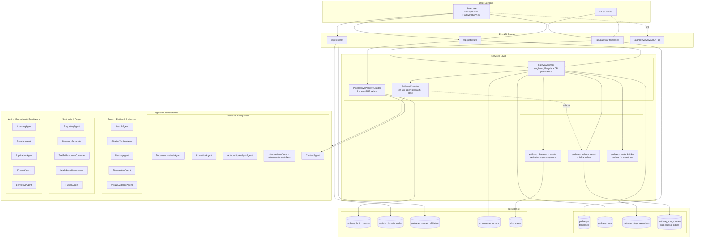
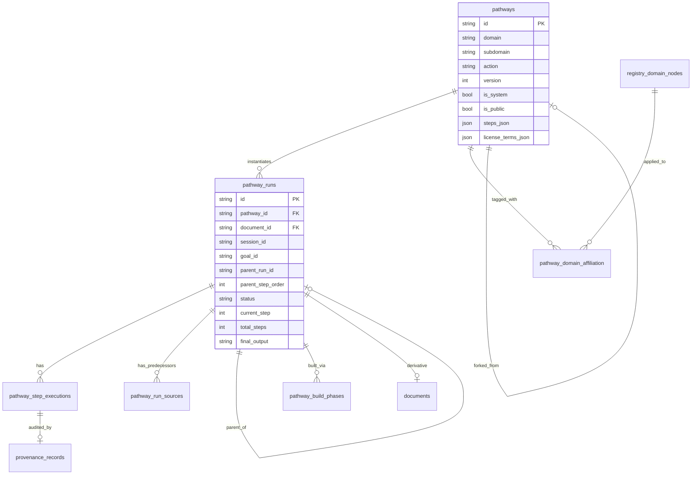
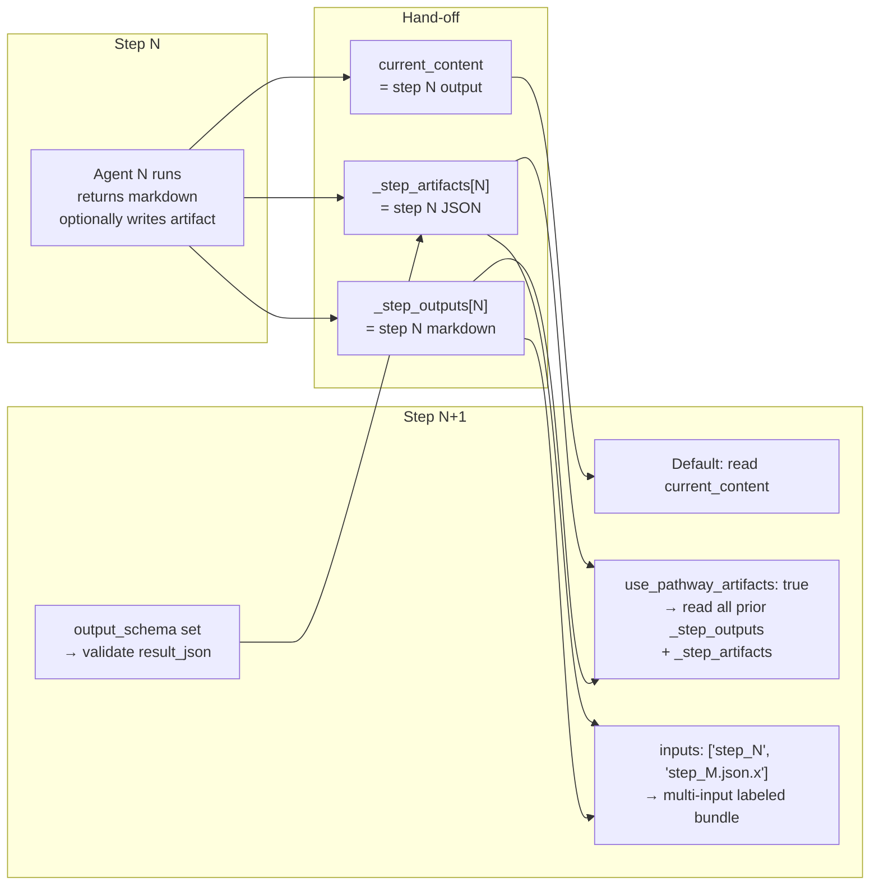
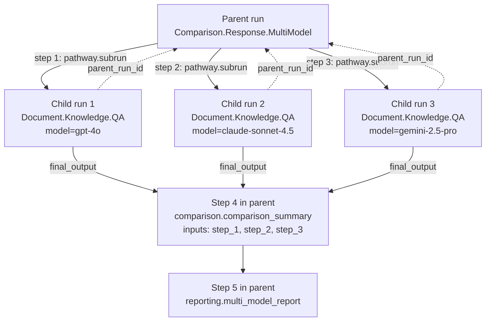
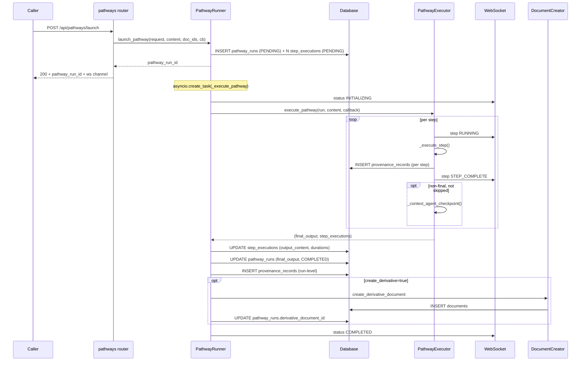
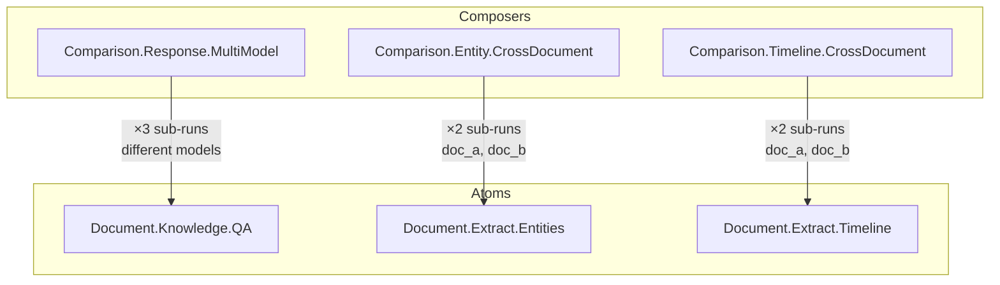
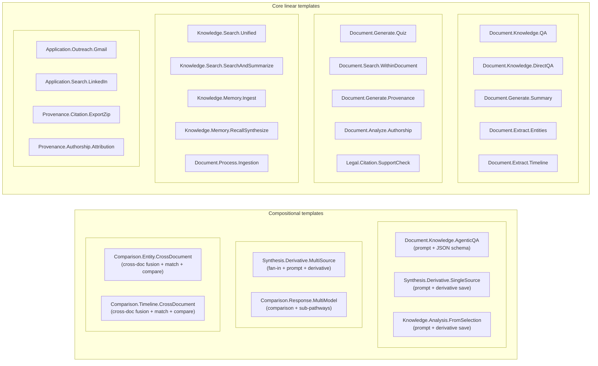

# Pathways Architecture & System Reference

**Status:** Reference / descriptive  
**Audience:** New engineers, product, integrators, pathway authors  
**Scope:** Every component of the Pathways subsystem in the Decision Intelligence User Layer System as implemented today, plus a full catalog of seeded pathways and how they compose.

**Document revision:** 1.1.0 — *Spec alignment* revision (2026-05-20). Brings the descriptive architecture document into coherence with [`PATHWAYS_REFERENCE_IMPLEMENTATION_SPEC.md`](PATHWAYS_REFERENCE_IMPLEMENTATION_SPEC.md) version **1.1.0** (*Authority Boundaries*). The companion RIS introduces autonomy bands, gate profiles, six registers of restraint, a `ToolGateway`, a `HandoffBus`, the practice-profile cold-start contract, and a spec-self-provenance discipline. This revision of the architecture document:

- adds "planned" / "alignment" rows where the engine must evolve to honor those normative contracts (the architecture document remains honest about what is shipped vs. planned in the canonical implementation),
- threads new fields (`gate_profile`, `autonomy`, `effective_gate_profile_json`, `spec_self_provenance_json`, new `PathwayRunSource.role` values) into the data-model narrative,
- references the RIS by section so implementers can read normative requirements without re-stating them here, and
- encodes its own origin and provenance as Pathways and PathwayRuns in [Appendix A — Architecture-Doc Spec Alignment Provenance](#appendix-a--architecture-doc-spec-alignment-provenance), extending the lineage recorded in RIS Appendix C.

**Pointer to spec:** when this document says *(planned, RIS 1.1.0 §X.Y)*, the spec's §X.Y is the normative source of truth; the engine described here will catch up section by section under the "1.1.0 alignment" roadmap track ([§19](#19-roadmap-and-engine-maturity)).

### How to read this document

Pathways are the **orchestration spine** of the **Intelligent Decision Engine (IDE)**: anything that is more than a single request/response—multi-step analysis, citation verification, cross-document comparison, derivatives, OCR fusion—is expressed as a **pathway template** and executed as an auditable **pathway run**. The sections below move from purpose and mental model, through schema and APIs, into a per-pathway reference. Use the table of contents if you are jumping to one concern (execution, registry, WebSocket, catalog).

**Formal sense register:** English overloads *domain* (pathway family vs. product facet vs. subject matter). For precise terminology—**pathway identity triple**, **registry node**, **context lens**, **capability**, and how they differ from legal “domains”—see [`docs/DOMAIN_AND_PATHWAYS_UNIFIED.md`](../docs/DOMAIN_AND_PATHWAYS_UNIFIED.md).

---

## Table of Contents

1. [Overview & Mental Model](#1-overview--mental-model)
2. [Architecture at a Glance](#2-architecture-at-a-glance)
3. [The Two-Layer Taxonomy](#3-the-two-layer-taxonomy)
4. [Data Model — Templates, Runs, Steps, Registry](#4-data-model--templates-runs-steps-registry)
5. [Agent Registry](#5-agent-registry)
6. [Execution Engine](#6-execution-engine)
7. [Inter-Step State, Artifacts, and Templating](#7-inter-step-state-artifacts-and-templating)
8. [Sub-pathways and the run hypergraph](#8-sub-pathways-and-the-run-hypergraph)
9. [Provenance, Derivatives, and Persistence](#9-provenance-derivatives-and-persistence) — Aqua: §9.6 (MVP), §9.7 (multi-user lineage & merge framing)
10. [API Surface](#10-api-surface)
11. [Real-Time Updates (WebSocket)](#11-real-time-updates-websocket)
12. [Progressive Pathway Builder](#12-progressive-pathway-builder)
13. [Frontend Integration](#13-frontend-integration)
14. [Lifecycle Walkthrough — From Launch to Completion](#14-lifecycle-walkthrough--from-launch-to-completion)
15. [Catalog of Existing Pathways](#15-catalog-of-existing-pathways)
16. [Pathway Relationships](#16-pathway-relationships)
17. [Configuration Surfaces](#17-configuration-surfaces)
18. [Marketplace, Forking, Versioning](#18-marketplace-forking-versioning)
19. [Roadmap and engine maturity](#19-roadmap-and-engine-maturity)
20. [Design Choices, Trade-offs, and Future State](#20-design-choices-trade-offs-and-future-state)
21. [Glossary](#21-glossary)
22. [References (Source Files)](#22-references-source-files)

---

## 1. Overview & Mental Model

### 1.0 A registry of recipes, scoped by domain—and by “sense”

Many **AI orchestration systems** still bury multi-step work in ad-hoc services: the same work is hard to **name**, **reuse**, **license**, or **audit** as a single artifact. Pathways invert that: each template is a **versioned, addressable recipe**—an identity triple `(Domain, Subdomain, Action)` plus steps, input/output contracts, and optional marketplace fields (`license_terms`, fork lineage, `is_public`). Executing a template produces a **pathway run** with step-level provenance, suitable for replay, compliance review, or promotion into a shared library.

In that light the system behaves as a modest **intellectual-property-style registry** for automation:

- **Named assets:** Templates are stable identifiers (not anonymous scripts). They can be forked, version-bumped, attributed, and filtered like published works.
- **Multi-dimensional indexing:** The same template is discoverable by *orchestration family* (`Document`, `Legal`, `Comparison`, …), by *product lens* (e.g. single-document vs multi-document view), and by *abstract capability* (`verify-claims`, `compare-and-reconcile`). Those facets live in the **domain registry** and attach via affiliations—see [section 3](#3-the-two-layer-taxonomy) and [section 4.9](#49-domain-registry-tables).
- **Different “senses” of domain:** The word *domain* must not be collapsed into one datatype. A pathway’s `Domain` segment is an **orchestration taxonomy**; registry slugs describe **discovery**; matter law and jurisdiction are **subject matter** elsewhere in the stack. Treating those as distinct *senses* keeps the architecture honest as the ontology grows.

**What is novel** is the combination: one **execution engine** for all multi-agent work, a **linear authoring model** that still composes via **sub-pathways** (each child run is a first-class run with its own audit trail), **dual channels** (markdown for humans, structured JSON for machines), and **built-in economics** (license metadata and usage counts) without mandating a separate workflow product.

The downstream consequence — and the thesis the rest of this document is in service of — is that a **pathway marketplace can emerge organically** from these primitives: no broker, no central catalog, no platform play required. Authors fork, attribute, and run templates locally; lineage and improvements travel with the manifest as **signed deltas**; peers selectively merge based on **contract compatibility + registry relevance**. The network of co-evolving pathways *is* the marketplace. Section [1.4](#14-how-a-marketplace-emerges-organically--peering-with-attribution-and-co-evolving-pathways) elaborates that high-level perspective; section [9.7](#97-multi-user-shared-pathways-aqua-lineage-deltas-and-registry-guided-merge) walks the multi-tenant mechanics; section [18](#18-marketplace-forking-versioning) covers the operational surface.

### 1.1 What a Pathway Is

A **Pathway** is the system's first-class unit of orchestration: a versioned, named, ordered sequence of **agent steps** that produces an auditable artifact (markdown document, structured JSON, ZIP export, derivative document, etc.) from a defined input contract. It is the mechanism by which the **Intelligent Decision Engine (IDE)** turns "what does the user want?" into "a series of agent invocations that I can replay, audit, fork, license, and compose with other pathways."

A pathway is *not* an LLM call, a chat message, an analysis session, or a goal. Pathways are the substrate: chat responses, comparisons, derivatives, evidence assessments, OCR fusion, citation verification — everything that involves more than a single immediate request — is implemented (or being migrated to) a pathway run.

### 1.2 Three Concepts to Distinguish

| Concept | What it is | Where it lives | Identifier |
|---|---|---|---|
| **Pathway template** (`Pathway`) | The *recipe*: identity triple `(domain, subdomain, action)`, version, ordered step list, contracts, license | `pathways` table | `pw_<12-hex>` |
| **Pathway run** (`PathwayRun`) | One *execution* of a template against concrete inputs (a document, a user query, optional goal/session) | `pathway_runs` table | `pr_<12-hex>` |
| **Step execution** (`PathwayStepExecution`) | One *agent invocation* inside a run — input/output, status, duration, model, provenance | `pathway_step_executions` table | UUID |

Templates are stable design artifacts. Runs are the live execution & audit log. Step executions are the leaf ledger.

### 1.3 Why Pathways

- **One execution model.** All multi-agent work uses one orchestrator (`PathwayExecutor`), not bespoke services.
- **One persistence story.** Every run is a `PathwayRun` row; every step is a `PathwayStepExecution`; every step optionally produces a `ProvenanceRecord`.
- **One audit trail.** Inputs, outputs, agent identifiers, model identifiers, durations, tokens, and (for `prompt` steps) full system + user prompts are all captured.
- **One UX surface.** A pathway picker (`PathwayPicker`) and run viewer (`PathwayRunView`) replace dozens of bespoke result screens.
- **Composability.** Sub-pathway invocation, structured artifact channels, and labeled multi-input fan-in let pathways consume each other's outputs.
- **Marketplace.** Templates carry `license_terms` and a `parent_pathway_id` fork lineage, enabling a pathway marketplace separate from the engine.

### 1.4 How a marketplace emerges organically — peering with attribution and co-evolving pathways

The architectural claim worth foregrounding before any schema or API is this: **nothing in this system requires a centralized "Pathway Marketplace" product to exist**. Once templates are addressable, forkable, attributable, and verifiable, a marketplace falls out as a side-effect of authors using the engine — even across organizations that share no infrastructure beyond the schema and a way to exchange template manifests. Four engine-level primitives do the work; the rest is social.

**1. Identity that travels.** Every template is a stable name (`pw_<hex>`, plus the human-friendly identity triple `Domain.Subdomain.Action@version`) wrapped around a JSON-serializable bundle (`steps`, `input_contract`, `output_contract`, `default_config`, `license_terms`). That bundle can be exported, exchanged, and re-seeded by any peer running the engine. Naming is portable; no central authority issues identifiers.

**2. Lineage that survives the export.** `parent_pathway_id` records every fork in SQL; **AquaTree** revisions ([§9.6](#96-aqua-protocol-attestations-shipped-mvp)) record the same lineage **cryptographically**, so a forked template carries *verifier-portable* derivation evidence. A peer who receives a fork can prove (a) what it was forked from, (b) at which template revision, and (c) — once DID-signing matures — *who* signed each step in the chain. That is the substance of **peering with attribution**: no shared database, no shared trust root — only shared signatures and verifiable hashes.

**3. Co-evolution by visible delta, not silent drift.** Bumping `version` is the only way to evolve a step contract; prompt and `default_config` tweaks land in-place but the AquaTree revision history fixes them in time. Any two snapshots of the same triple — or any two forks of a common ancestor — yield a **frozen, reviewable delta**: a diff over the ordered `PathwayStep` list, agent ids, `inputs:` contracts, and `output_schema`. Improvements propagate as inspectable patches, not opaque rewrites; "what did this fork *change*?" is always a well-defined question.

**4. Selective uptake, gated by two structured filters.** Adoption is *opt-in*, never push. The two-layer taxonomy ([§3](#3-the-two-layer-taxonomy)) provides the discriminators that keep the merge surface narrow even when many peers fork in parallel:

- **Contract compatibility** — does the delta still compile inside *my* fork's step contracts (`version`, agent ids, required `inputs:`, `output_schema`)? Mechanical check.
- **Registry / domain relevance** — does the delta target the same **`abstract_capability`**, **`context_lens`**, or **`composite_domain`** my fork already occupies? `pathway_domain_affiliation` (with `source` provenance) makes this filter mechanical too.

Both checks pass → safe candidate for cherry-pick. Either fails → the change is shelved, regardless of how widely it's spreading elsewhere. The registry is doing **noise-rejection** at the network level. (See [§9.7](#97-multi-user-shared-pathways-aqua-lineage-deltas-and-registry-guided-merge) for the end-to-end flow.)

**Run data stays private throughout.** Each `PathwayRun` belongs to one tenant — its document, query, prompts, outputs, and `provenance_records` are isolated. What's shared across the marketplace is the **recipe** (the template) and, optionally, an **attestation** that proves *this run cited that recipe at that revision* without exposing the run's content. That separation is what lets multiple firms fork, run, and selectively merge improvements to (say) `Legal.Citation.Verification` without ever pooling client matter data.

**Why "organic" is the right word.** The picture is the inverse of the usual platform-marketplace model:

| Conventional marketplace | Organic pathway marketplace |
|---|---|
| Central catalog + broker | Peer-to-peer template exchange |
| Trust the platform | Verify signatures + hashes locally |
| Push updates to all subscribers | Each peer pulls deltas it chooses |
| Platform owns discovery | Discovery is registry-tag overlap |
| Platform monetizes | `license_terms` travels with the template |
| Forks fragment the ecosystem | Forks *are* the ecosystem; deltas reconverge selectively |

There is no broker because **none is needed**. Templates are signed; deltas are computable; registry tags carry the discovery signal; license terms travel inline; `usage_count` and provenance accumulate independently per tenant. Forks proliferate, attribution survives, and the network of co-evolving pathways *becomes* the marketplace — not because anyone built a marketplace product, but because the substrate makes attribution and selective merge cheap enough that the social behavior is the load-bearing piece.

This framing recurs throughout the document. [§9.6](#96-aqua-protocol-attestations-shipped-mvp) is the cryptographic substrate; [§9.7](#97-multi-user-shared-pathways-aqua-lineage-deltas-and-registry-guided-merge) is the multi-tenant lineage / deltas / merge story; [§18](#18-marketplace-forking-versioning) is the operational surface (license terms, fork API, `is_public`, the seeder). Read them as three views of the same emergent dynamic.

### 1.5 Capabilities shipped vs. deferred (May 2026)

| Capability | Status |
|---|---|
| Linear step pipeline with markdown hand-off (`current_content`) | ✅ Core |
| Structured artifact channel between steps (`_step_artifacts[order]`, `use_pathway_artifacts: true`) | ✅ |
| Free-form `prompt` agent step with `{{var}}` templating | ✅ |
| Structured `result_json` artifact + optional `output_schema` on `PathwayStep` | ✅ |
| First-class `derivative` agent (`save`, `save_step`, `link_to_goal`, `chain`) | ✅ |
| Sub-pathway invocation via `pathway` agent (parent/child linkage + `pathway_run_sources`) | ✅ |
| Multi-input fan-in (`inputs:`) + `fusion` agent | ✅ |
| Comparison stack: `comparison`, `entity_match`, `fact_compare`, `timeline_merge` | ✅ |
| Parallel step group declaration (`parallel:` on step config) | ⚠ Declared; runtime still executes steps sequentially ([section 19](#19-roadmap-and-engine-maturity)) |
| Inter-step Context Agent checkpoint (`proceed` / `halt`; `modify` / `inject` stubbed) | ✅ Partial |
| Conditional branching (`when` / `unless`) and bounded loops (`for_each`, `loop.back_to`) | ❌ Planned |
| Cross-pathway scratchpad keyed on `goal_id` | ❌ Planned |
| Dedicated goal / outcome / action / offer step agents | ❌ Planned |
| **Aqua Protocol attestations** (template + run trees, `/api/aqua` verify; sidecar MVP) | ✅ Partial — [§9.6](#96-aqua-protocol-attestations-shipped-mvp) |
| Aqua link revisions for every **`pathway_run_sources`** edge (full G11 ↔ crypto parity) | ❌ Planned |
| Marketplace “merge queue” / cross-org delta subscription | ❌ Planned — [§9.7](#97-multi-user-shared-pathways-aqua-lineage-deltas-and-registry-guided-merge) |
| **Autonomy band on every `PathwayRun`** (`A0..A3`) | ❌ Planned — RIS 1.1.0 §4.8.1 |
| **`gate_profile` manifest** on templates (six registers R1–R6) | ❌ Planned — RIS 1.1.0 §4.8.2–§4.8.4 |
| **Escalation rule** enforced at launch (refuse under-gated runs) | ❌ Planned — RIS 1.1.0 §4.8.3 |
| **Practice profile** (R1 cold-start, DID-signed registry node) | ❌ Planned — RIS 1.1.0 §4.8.5 |
| **`ToolGateway`** (R2 capability + R4 budget + R5 halt + R6 phase) | ❌ Planned — RIS 1.1.0 §4.8.7 |
| **`HandoffBus`** (R3 closed-intent schema + audit at every seam) | ❌ Planned — RIS 1.1.0 §4.8.7 |
| **Per-step `capability_profile`** (allow/deny tools; `allow_sub_pathways`) | ❌ Planned — RIS 1.1.0 §4.8.8 |
| **`phase`-modulated permissions** (deny-wins intersection on R6) | ❌ Planned — RIS 1.1.0 §4.8.9 |
| **`non_delegable_acts`** engine enforcement (engine-blocked autonomous commits) | ❌ Planned — RIS 1.1.0 §4.8.4 |
| **Fork-and-disable visibility** (Aqua `register_removed` delta + marketplace `gates_removed` badge) | ❌ Planned — RIS 1.1.0 §4.8.10 |
| **`PathwayRunSource.role`** extended with `prompt`, `primary_source`, `non_delegable_approval` | ⚠ Partial (today: `subrun` / `context` / `fork_origin` / `primary`) — RIS 1.1.0 §C.4 |
| **Meta-pathways for spec self-provenance** (`Pathways.Spec.*@v1` seed family) | ❌ Planned (seed forthcoming) — RIS 1.1.0 §C.3, §C.7 |

The catalog is **28 seeded system pathway templates** ([section 15](#15-catalog-of-existing-pathways)) plus user and ad-hoc templates from the [Progressive Pathway Builder](#12-progressive-pathway-builder), all on the same [Execution Engine](#6-execution-engine).

---

## 2. Architecture at a Glance



Three thin layers — routers, services, agents — over a small but precise schema. The engine's surface area is intentionally narrow: a step runs an agent, the agent returns markdown plus an optional structured artifact, the runner persists everything, and the WebSocket streams it.

---

## 3. The Two-Layer Taxonomy

Every pathway exists in two parallel naming systems. They answer different questions and have different mutability rules.

### 3.1 Layer 1 — The Identity Triple

Every pathway template has a tuple `(domain, subdomain, action) + version` that uniquely identifies it. Defined in `PathwayTable.__table_args__`:

```python
UniqueConstraint("domain", "subdomain", "action", "version", name="uq_pathway_identity")
```

**Examples**: `Document.Knowledge.QA`, `Legal.Citation.Verification`, `Comparison.Response.MultiModel`.

- **PascalCase** for each segment.
- **Immutable** for a given version. Bumping `version` is the only way to evolve a step contract.
- **Used by**: the engine (template lookup), URLs, logs, the Pathway Marketplace, and human conversation.
- **Resolution**: The sub-pathway agent accepts either the triple (`Document.Knowledge.QA`) or the raw template id (`pw_…`). See [`pathway_subrun_agent.resolve_template`](backend/app/services/pathway_subrun_agent.py).

### 3.2 Layer 2 — The Domain Registry

Beyond the triple, each template can be tagged with an arbitrary number of **registry domain nodes** — slugs that drive picker filtering, UI grouping, and recommendation surfaces. These live in `registry_domain_nodes`, with `kind ∈ {composite_domain, context_lens, abstract_capability, agent_role}`.

| Kind | Purpose | Examples |
|---|---|---|
| `composite_domain` | Product-level grouping (primary picker facet) | `legal-practice`, `knowledge-management`, `comparison-and-diff`, `synthesis-and-derivation`, `audit-and-provenance`, `outreach-and-applications`, `evidence-management`, `document-lifecycle` |
| `context_lens` | Cross-cutting perspective (secondary picker filter, often page-driven) | `single-document-view`, `multi-document-view`, `application-attached-view`, `audit-and-provenance-view` |
| `abstract_capability` | Verb-noun: what the pathway does, regardless of subject | `extract-structured-data`, `verify-claims`, `compare-and-reconcile`, `synthesize-derivative`, `generate-report`, `index-and-recall`, `automate-browser`, `render-export` |
| `agent_role` | Auto-seeded mirror of the agent registry; one per `AGENT_MANIFESTS` entry | `agent_role_analysis`, `agent_role_extraction`, `agent_role_verification`, etc. |

Templates and nodes are joined by `pathway_domain_affiliation` rows that carry a `weight` and a `source` (`USER`, `INFERRED_FROM_AGENTS`, `INFERRED_FROM_QUERY`, `INFERRED_FROM_EMBEDDING`, `INFERRED_FROM_RAG`, `INFERRED_FROM_TANTIVY`, `INFERRED_FROM_POSTGRES`). User affiliations come from each seed's `affiliations: [...]` field; agent-role affiliations are auto-inferred by [`infer_and_persist_agent_affiliations`](backend/app/services/domain_affinity_inference.py).

### 3.3 Why Two Layers

- **Identity is the contract** — the triple goes in URLs and logs. Changing it is a versioning event.
- **Tags are the discovery surface** — they're how the picker says "show me all single-document pathways that generate reports." Adding a tag is a metadata change, not a contract change.

The picker queries the join table directly:

```text
GET /api/pathway-templates/?lens=single-document-view
                            &composite_domain=knowledge-management
                            &capability=extract-structured-data
```

The implementation in [`pathway_templates.list_pathways`](backend/app/routers/pathway_templates.py) joins through `PathwayDomainAffiliationTable` and intersects across all requested facets (AND semantics).

---

## 4. Data Model — Templates, Runs, Steps, Registry

This is the canonical schema. Both Pydantic value objects (for the API) and SQLAlchemy tables (for persistence) live alongside each other in [`backend/app/models/pathway.py`](backend/app/models/pathway.py), [`backend/app/models/pathway_run.py`](backend/app/models/pathway_run.py), and [`backend/app/models/domain_registry.py`](backend/app/models/domain_registry.py).

### 4.1 The `Pathway` Template

```python
class Pathway(BaseModel):
    id: str                                      # pw_<hex>
    domain: str
    subdomain: str
    action: str
    display_name: str
    description: Optional[str]
    version: int                                  # default 1; bump on contract change

    steps: List[PathwayStep]                      # ordered, 1-based
    input_contract: Optional[PathwayContract]
    output_contract: Optional[PathwayContract]
    default_config: Optional[Dict[str, Any]]      # e.g. {"mode": "standard"}
    trigger_config: Optional[Dict[str, Any]]      # reserved for scheduling

    originator_id: Optional[str]
    parent_pathway_id: Optional[str]              # fork lineage
    parent_pathway_version: Optional[int]
    license_terms: Optional[PathwayLicenseTerms]  # marketplace economics

    is_public: bool
    is_system: bool                               # set by the seeder
    usage_count: int                              # incremented per execution
    tags: Optional[List[str]]                     # keyword search hints
```

Storage is JSON-encoded for `steps`, `input_contract`, `output_contract`, `default_config`, `trigger_config`, `tags`, and `license_terms` (see `_serialize` / `_safe_json_loads` in [`crud/pathway.py`](backend/app/crud/pathway.py)). The serialization round-trip is responsible for revival via Pydantic constructors.

### 4.2 The `PathwayStep` (template-side)

```python
class PathwayStep(BaseModel):
    agent_id: str                                 # canonical id (or alias; see section 5.1)
    order: int                                    # 1-based
    skill: str = ""                               # branch-discriminator within an agent
    config: Dict[str, Any] = {}                   # agent-specific config bag
    agent_name: str = ""                          # display name
    expected_output: str = ""                     # human-readable contract
    input_prompt: str = ""                        # step-level instructions
    llm_system_prompt: str = ""                   # for prompt/analysis/reporting
    llm_user_prompt_template: str = ""            # supports {{var}} substitution
```

### 4.3 The `PathwayStepConfig` (run-side, snapshot)

When a launch request arrives, the template's `PathwayStep[]` is materialized into `PathwayStepConfig[]` and snapshotted onto the run row. The run-side variant carries **runtime extras**:

| Field | Source | Used by |
|---|---|---|
| `use_raw_content` | step config | Executor (only honored on step 1; loads original PDF text instead of extracted markdown) |
| `output_schema` (JSON Schema) | template `PathwayStep` | `PromptAgent.complete_step` validation; populates `_step_artifacts[order]['result_json']` |
| `inputs: List[str]` | step config | Executor's `_build_step_inputs_bundle` for fan-in to `fusion`/`comparison`/`entity_match`/etc. |
| `parallel: str` | step config | Reserved field; runtime activation pending |
| `suggested_model`, `suggested_skills`, `step_suggestions` | builder/precheck | Run viewer; not consumed by executor today |
| `prompt_attribution` | builder | Used by `PromptAgent.rewrite_prompt` post-run |
| `source_type` | runner | `REGISTRY` / `DYNAMIC` / `HYBRID` |

The `inputs:` mini-DSL accepts:

- `step_<N>` — markdown output of step N from `_step_outputs`
- `step_<N>.json` — full structured payload from `_step_artifacts[N]['result_json']`, JSON-encoded
- `step_<N>.json.<dotted.path>` — dotted lookup into the artifact

### 4.4 The `PathwayRun`

```python
class PathwayRun(BaseModel):
    id: str                                       # pr_<hex>
    pathway_id: str                               # template id this run instantiates
    document_id: str
    session_id: Optional[str]                     # analysis session
    goal_id: Optional[str]                        # decision-intelligence link (Future State)
    derivative_document_id: Optional[str]         # auto-derivative result
    step_document_ids: List[str]                  # per-step on-demand saves

    steps: List[PathwayStepConfig]                # snapshot at launch
    meta_prompt: str
    execution_notes: str
    user_query: str
    referenced_urls: List[str]                    # for browsing agent

    pathway_outline: Optional[Dict]               # built by pathway_meta_builder
    suggested_models: Optional[Dict]
    suggested_skills: Optional[Dict]
    suggested_prompts: Optional[Dict]
    pathway_suggestions: Optional[Dict]

    status: PathwayRunStatus
    current_step: int
    total_steps: int

    step_executions: List[PathwayStepExecution]   # leaf ledger

    created_at, started_at, completed_at: datetime
    total_duration_ms: Optional[int]

    final_output: Optional[str]                   # the run's final markdown
    final_output_summary: Optional[str]

    total_tokens_used: int
    agents_from_registry: int
    agents_dynamic: int

    error_message: Optional[str]
    error_step: Optional[int]

    is_test_run: Optional[str]                    # "test" if synthetic
    build_id: Optional[str]                       # progressive build linkage

    # Sub-run linkage
    parent_run_id: Optional[str]                  # set when launched as a sub-run
    parent_step_order: Optional[int]
```

### 4.5 `PathwayRunStatus` and `PathwayStepStatus`

```text
PathwayRunStatus: PENDING → INITIALIZING → BUILDING → RUNNING ⇄ STEP_COMPLETE → COMPLETED
                                                                              → FAILED
                                                                              → CANCELLED

PathwayStepStatus: PENDING → RUNNING → COMPLETED | FAILED | SKIPPED
```

The runner only writes terminal states (`COMPLETED`/`FAILED`/`CANCELLED`) once. `STEP_COMPLETE` is a transient ribbon between `RUNNING` events.

### 4.6 The `PathwayStepExecution`

Captures per-step audit data. Notable fields:

- `output_content` — full output (capped at ~10kB when written to provenance, but stored fully on the row).
- `output_summary` — first 500 chars (used in lists).
- `model_provider` / `model_name` — pulled off the agent at write time.
- `agent_config_json` — JSON snapshot of `step.config`.
- `provenance_record_id` — back-reference to the per-step `provenance_records` row.

### 4.7 `PathwayRunSourceTable` — The run hypergraph

Beyond the linear `parent_run_id` linkage, child runs can record arbitrary upstream contributions:

```python
class PathwayRunSourceTable(SQLBase):
    id: str
    child_run_id: str        # FK pathway_runs.id
    parent_run_id: str       # FK pathway_runs.id
    role: str                # "primary" | "context" | "fork_origin" | "subrun"
    artifact_path: str | None  # e.g. "step_4.json.entities"
    weight: float
```

The `role` field labels the relationship so the run viewer can render meaningful predecessor graphs (a multi-source synthesis run can declare "this run consumed the `result_json` of step 4 of run *abc* plus the `final_output` of run *xyz*"). Today the sub-run launch path is the primary writer (`role="subrun"`); other roles are reserved for the multi-source composer flows.

**RIS 1.1.0 alignment (planned):** the spec's Appendix C introduces two additional reserved values for the `role` enum used for **spec-self-provenance**:

- **`prompt`** — links a stored prompt artifact (a `doc:` pointer or hashed string) to the run it shaped. Used to bind authored prompts (e.g., the P1–P7 sequence in RIS §C.2) to the runs they triggered, so a future replay can reconstruct *which words from whom* drove each step.
- **`non_delegable_approval`** — marks the human-approval edge required by `gate_profile.non_delegable_acts` on the *apply* step of a meta-pathway (RIS §4.8.4). Runs lacking this edge **MUST NOT** mutate the artifact named in their `non_delegable_acts` declaration.

A third value, **`primary_source`**, is already implied by today's `role="primary"` but is named explicitly in RIS §C.4 for clarity when the predecessor is an external document (article, paper, repository) bound by a `doc:` pointer rather than another run. The engine should accept either form; the canonical seed will use `primary_source` going forward.

### 4.8 `PathwayBuildPhase` — Progressive Build Audit Log

When a pathway is constructed via the Progressive Builder, each of the 6 phases records a `pathway_build_phases` row keyed on a `build_id`. The phase row carries the prompt text, the model used, the token counts, and the response, then links to the eventual `pathway_run_id` once the user accepts the build. This makes the *construction* of every ad-hoc pathway as auditable as its execution.

### 4.9 Domain Registry Tables

```python
RegistryDomainNodeTable:
    id, slug, display_name, kind, agent_manifest_id?, metadata_json

PathwayDomainAffiliationTable:
    id, pathway_id, domain_node_id, weight, source, creation_context_json
    UNIQUE (pathway_id, domain_node_id, source)
```

The `UNIQUE` clause means each pathway can have multiple affiliations to the same node only when each comes from a different `source` (e.g. user-tagged + inferred-from-agents both pointing at `legal-practice`). This is by design: source provenance matters for trust scoring.

### 4.10 Schema Diagram



### 4.11 RIS 1.1.0 alignment: `gate_profile`, `autonomy`, and spec self-provenance (planned)

This subsection captures the **target shape** of the data model required by RIS 1.1.0 §4.8 and §C. None of the columns below exist in the canonical implementation today; they are normative for any conformant Level-F+ implementation declaring spec ≥ 1.1.0 and the canonical implementation will add them under the "1.1.0 alignment" roadmap track ([§19](#19-roadmap-and-engine-maturity)).

#### 4.11.1 New fields on `Pathway` (template-side)

| Column | Type | Purpose |
|---|---|---|
| `gate_profile_json` | TEXT (nullable) | The structured manifest from RIS §4.8.4: `default_autonomy`, `max_autonomy`, `escalation_rule`, the six `registers` blocks, `non_delegable_acts`, and the template-author DID attestation. **REQUIRED** for templates declaring `default_autonomy` ≥ A2. |
| `gate_profile_hash` | VARCHAR | SHA-256 of the canonical-serialized `gate_profile_json`, recorded in the run's provenance so replays can detect drift. |

The template author signs `gate_profile_json` separately from the rest of the template body — the gate profile is the **authority surface** of the template; changes to it trigger a `gate_profile_changed` AquaTree revision distinct from changes to step prompts.

#### 4.11.2 New fields on `PathwayStep`

| Field | Type | Purpose |
|---|---|---|
| `phase` | str (nullable) | Named workflow stage; merges with `gate_profile.R6.phase_defaults` at execution time (RIS §4.8.9). |
| `capability_profile` | dict (nullable) | `allow_tools`, `deny_tools`, `allow_sub_pathways`, `allow_agents` (RIS §4.8.8). Deny-wins intersection with phase defaults. |
| `human_gate` | enum `none` \| `optional` \| `required` (default `none`) | Engine-enforced block at autonomy ≥ A1 when set to `required`; persisted approval entry required before completion. |

#### 4.11.3 New fields on `PathwayRun`

| Column | Type | Purpose |
|---|---|---|
| `autonomy` | VARCHAR (enum `A0` \| `A1` \| `A2` \| `A3`) | The run's declared autonomy band. Resolved from launch request ∪ template default; capped at `template.gate_profile.max_autonomy`. |
| `effective_gate_profile_json` | TEXT | Snapshot of the *resolved* `gate_profile` at launch (template + tenant overrides + practice-profile binding hash). What the engine actually enforced for this run. |
| `practice_profile_revision_hash` | VARCHAR (nullable) | The Aqua revision hash of the practice profile in force at launch (RIS §4.8.5). Required when `effective_gate_profile_json.R1.enabled = true`. |
| `gate_profile_violations_json` | TEXT (nullable) | Structured record of any `warn` / `audit-only` waivers permitted at launch. Empty for `strict` runs (which would have been rejected instead of allowed through with violations). |
| `spec_self_provenance_json` | TEXT (nullable) | Optional block from RIS §C.4: `spec_doc_ref`, `spec_version_before`, `spec_version_after`, `upstream_source_ref`, `user_did`, `assistant_model`, `prompt_index`, `prompt_artifact_ref`, `output_artifact_ref`. Populated for meta-pathway runs that themselves change Pathways spec or other Pathways system artifacts. |

#### 4.11.4 New fields on `PathwayStepExecution`

| Column | Type | Purpose |
|---|---|---|
| `gate_decision` | enum `allowed` \| `blocked_gate` \| `budget_exceeded` \| `run_halted` \| `tool_denied` | The `ToolGateway` outcome (RIS §4.8.7). `allowed` is the common case; the others terminate the step before agent invocation. |
| `handoff_envelope_id` | UUID (nullable) | When this step triggered a seam (sub-run launch, external action), the `HandoffEnvelope.id` validated by `HandoffBus`. NULL otherwise. |
| `human_approval_entry_id` | UUID (nullable) | Pointer to the human-approval record (a separate table) when the step required one. |

#### 4.11.5 New table: `handoff_audit_records`

The append-only log mandated by RIS §4.8.7 (R3) for every seam crossing:

```python
class HandoffAuditRecord(SQLBase):
    id: str                          # UUID
    run_id: str                      # FK pathway_runs.id
    step_order: int
    accepted: bool
    rejection_reason: str | None
    intent: str                      # closed enum per template handoff_schema
    target: str                      # validated target
    params_keys_json: str            # list of validated parameter names
    raw_event_len: int
    sanitized_event_len: int
    signed_by: str                   # DID
    signature_bytes: bytes
    created_at: datetime             # append-only; no UPDATE/DELETE
    aqua_revision_id: str | None     # link to Aqua revision when applicable
```

Indexes: `(run_id, step_order)`, `(accepted, created_at)`, `(intent, created_at)`. The table **MUST** reject any UPDATE or DELETE against existing rows at the database layer (e.g., a Postgres trigger).

#### 4.11.6 New registry kind: `practice_profile`

`RegistryDomainNodeKind` gains a fifth value: `practice_profile`. Profiles are tenant-scoped, DID-signed, Aqua-attested, and referenced from `gate_profile.R1.practice_profile_ref` by `did:...#slug@version` (RIS §4.8.5). The existing `kind ∈ {composite_domain, context_lens, abstract_capability, agent_role}` set is preserved; `practice_profile` joins them without breaking the existing affiliation join.

---

## 5. Agent Registry

The engine ships with **20 agents**. They are registered in `PathwayExecutor.AGENT_REGISTRY` and (mostly) eagerly instantiated in `_initialize_agents`. A separate `AGENT_MANIFESTS` dict in [`context_agent.py`](backend/app/services/context_agent.py) carries human-readable metadata for the Context Agent's matcher and the registry-node auto-seeder.

### 5.1 Registry Table

| `agent_id` | Class / module | LLM? | Purpose | Skills (selected) |
|---|---|---|---|---|
| `conversion` | `TextToMarkdownConverter` | No | Plain text / PDF text → structured markdown | `markdown_normalize` |
| `compression` | `MarkdownCompressor` | No | Reduce token count without info loss | `default` (TOON tables, whitespace, etc.) |
| `extraction` | `ExtractionAgent` | Yes | Timeline events, entities, citations | `entities`, `timeline`, `both`, `case_citations`, `legal_references`, `facts` |
| `analysis` | `DocumentAnalysisAgent` | Yes | Multi-mode RAG / direct / agentic / support-check / fusion | mode = `quick \| standard \| deep \| agent \| direct \| support_check`; skills include `content_fusion`, `evidence_categorization`, `wear_tear_classification`, `quiz_generation`, `provenance`, `relevance_score`, `rag_qa`, `synthesize`, `strategy` |
| `summary` | `SummaryGenerator` | Yes | Single-output summaries | `default` |
| `authorship` | `AuthorshipAnalysisAgent` | Yes | Stylometric / metadata-based authorship | `analyze` |
| `search` | `SearchAgent` | No | External search (Tavily, Brave, Perplexity) | `single`, `batch_search`, `unified`, `in_document` |
| `verification` | `CitationVerifierAgent` | No | Deterministic citation lookup against authoritative DBs | `database_verification` (CourtListener, Cornell LII, GovInfo) |
| `reporting` | `ReportingAgent` | Yes | Render markdown / PDF / charts / infographics | `legal_formatting`, `document_correction`, `cite_review_zip`, `entity_table`, `timeline_render`, `quiz_render`, `comparison_report`, `wear_tear_report`, `evidence_assessment_report`, `briefing`, `unified_results`, `multi_model_report`, `timeline_diff`, `attribution_log`, `provenance_record`, `result_table`, `authorship_summary`, `status_dashboard` |
| `session` | `SessionAgent` | No | Ensure a logged-in browser session for an application | `ensure` |
| `browsing` | `BrowsingAgent` | No | Playwright-driven browser automation | `send`, `browse` |
| `application` | `ApplicationAgent` | No | App-specific actions (Gmail, LinkedIn) over a browsing session | `compose`, `linkedin_search` |
| `contextualization` | `ContextAgent` | Yes | Match/route queries; produce pathway proposals; inter-step checkpoints | `process`, `precheck` |
| `memory` | `MemoryAgent` | No | Sub-5ms semantic / BM25 / hybrid recall over ingested content | `ingest`, `recall`, `hybrid` |
| `prompt` | `PromptAgent` | Yes | General-purpose LLM step + post-run prompt rewriter | `complete_step` (used by executor); `rewrite_prompt` (post-run) |
| `recognition` | `RecognitionAgent` | No | OCR via Tesseract or Surya | `tesseract_ocr`, `surya_ocr` |
| `visual_evidence` | `VisualEvidenceAgent` | No | YOLOv8 + EXIF + integrity scoring | `directory_inventory`, `visual_classification`, `evidence_metadata`, `evidence_assembly` |
| `derivative` | `DerivativeAgent` | No | Persist content as a `Document` | `save`, `save_step`, `link_to_goal`, `chain` |
| `pathway` | `pathway_subrun_agent.launch_subrun` | No | Launch another pathway as a child run | `subrun` |
| `fusion` | `FusionAgent` | Yes (optional) | Combine multiple labeled inputs into one payload | `concat`, `llm_merge`, `pick_best`, `weighted_blend` |
| `comparison` | `ComparisonAgent` | Yes | LLM-narrative diff over structured comparison artifacts | `comparison_summary` |
| `entity_match` | `EntityMatcher` wrapper | No | Threshold-based entity matching | `match` |
| `fact_compare` | `FactComparator` wrapper | No | Per-fact alignment / diff | `compare` |
| `timeline_merge` | New deterministic | No | Two-source timeline dedupe + diff | `merge`, `diff` |

### 5.2 Aliases

The executor accepts a long list of aliases (`AGENT_ALIASES`) so LLM-generated pathways using common synonyms ("rewriter", "summarize", "ocr", "scan", "writing", "drafting", …) still resolve. Notable mappings: `synthesize`/`synthesis` → `reporting`; `strategy`/`research` → `analysis`/`search`; `recall`/`remember` → `memory`. Resolution happens once per step in `resolve_agent_id`.

### 5.3 Skill Resolution

A step's "skill" — the discriminator within an agent — comes from one of:

1. The top-level `skill` field on `PathwayStepConfig` (preferred since the cite.review-aligned refactor)
2. `step.config["skill"]` (legacy)
3. The agent-class default

The helper `PathwayExecutor._resolve_skill(step, default=...)` encodes this fallback chain.

### 5.4 LLM/Provider Routing

Each agent owns its own model choice:

- `analysis`, `extraction`, `authorship`: `anthropic/claude-sonnet-4.5` by default.
- `summary`, `reporting`: provider-driven via internal config (often Claude Sonnet 4.5).
- `prompt`: per-step `config.model` (no default at the step level — seeds set their own).
- `fusion`/`comparison` (when LLM-driven): `claude-sonnet-4.5` by default.
- Inter-step `contextualization` checkpoint: hardcoded `anthropic/claude-sonnet-4-20250514` for cost reasons.

The agents call `litellm` directly. Provider routing follows `litellm`'s standard prefix syntax (`anthropic/...`, `gemini/...`, `openai/...`).

---

## 6. Execution Engine

The execution engine is two cooperating singletons.

### 6.1 `PathwayRunner` — Lifecycle & Persistence

[`backend/app/services/pathway_runner.py`](backend/app/services/pathway_runner.py)

Responsibilities:

1. **Accept launch requests** (`launch_pathway(LaunchPathwayRequest, document_content, document_ids, progress_callback, raw_document_content)`).
2. **Persist the run row** (`pathway_runs`) with `status = PENDING`, snapshotting all `steps` and the meta-builder outputs.
3. **Spawn background execution** via `asyncio.create_task(_execute_pathway(...))`.
4. **Materialize step rows** with `status = PENDING` for the entire ladder up front (one row per step).
5. **Construct a `PathwayExecutor`** with the right `document_ids`, `agent_skills` (loaded from the Skills Registry), `raw_document_content`, and `skip_checkpoints` flag (forced for `is_test_run` and progressive-build runs).
6. **Pass a progress callback** that dual-writes status updates to the in-memory run, the database, and the WebSocket.
7. **Receive the final output and step results**, persist them in full (including `output_content`), then write a *run-level* provenance record on top of the per-step ones.
8. **Optionally create a derivative document** via `pathway_document_creator.create_derivative_document` when `request.create_derivative` is true (the legacy auto-derivative path; new pathways express this as an explicit `derivative` step).
9. **Index the derivative** for unified search (`record_indexer.index_derivative_document`).
10. **Update the run row** with `final_output`, `final_output_summary`, `derivative_document_id`, durations, token counts, and terminal status.
11. **Manage cancellation** (`cancel_run` flips the status to `CANCELLED` if the run is still pre-terminal; the executor checks status between steps).

### 6.2 `PathwayExecutor` — Step Dispatch & State

[`backend/app/services/pathway_executor.py`](backend/app/services/pathway_executor.py) (~2,100 lines)

Responsibilities:

1. **Hold per-run state**: `_step_outputs: Dict[int, str]` (markdown per step), `_step_artifacts: Dict[int, Any]` (structured per step), `_pathway_run` (the active `PathwayRun` for the `derivative` and `pathway` step types), `_document_ids`, `_agent_skills`, `_raw_document_content`, `_skip_checkpoints`.
2. **Iterate `pathway_run.steps` linearly** — one big `for step in pathway_run.steps` loop. (`parallel:` groups are declared on templates but the runtime still executes them sequentially; see section 19.)
3. **Call `_execute_step(step, current_content, user_query, referenced_urls)`** which dispatches on `agent_id` to a tall `if/elif` chain — one branch per agent type — each of which knows how to call its agent's idiomatic API.
4. **Update `current_content`** to the step's output before the next iteration. (`current_content` is the implicit "previous step's output" — the default input bus for any step that doesn't use the `inputs:` fan-in channel.)
5. **Persist a per-step `ProvenanceRecord`** with the agent name, model, durations, system+user prompts, and a 10kB output excerpt.
6. **Emit progress updates** via the callback before and after each step (`RUNNING` → `STEP_COMPLETE`).
7. **Run the inter-step Context Agent checkpoint** unless `_skip_checkpoints` is true. Today the only honored decisions are `proceed` (default) and `halt` (early-terminates the run); `modify` and `inject` are logged but not yet enacted.
8. **Post-process the final output** via `_cleanup_raw_code` to strip stray D3.js/SVG snippets that some LLMs emit (a long-running pragmatic guard).

### 6.3 The `_execute_step` Branch Map

Each branch follows a small, predictable shape: pull from `step.config`, optionally consult `_step_outputs` / `_step_artifacts`, call the agent, return markdown (and optionally write `_step_artifacts[step.order]`).

| Branch | Inputs honored | Artifacts written | Notes |
|---|---|---|---|
| `conversion` | `current_content` | — | `result.converted_content` |
| `compression` | `current_content` | — | `result.compressed_content` |
| `extraction` | `current_content`; `mode` from config | `legal_references` (typed) for `legal_references` mode; `legal_references` (case-only shape) for `case_citations` mode | Falls back gracefully when content is short |
| `analysis` | `current_content`, `_document_ids`, `step.input_prompt`, `step.llm_system_prompt`, `_step_artifacts` (when `use_pathway_artifacts` or skill in `{support_check, citation_verification, deduplication}`) | — | When upstream content is present, **forces `DIRECT` mode** so the prose isn't dropped by RAG. Falls back to `summary` if no `document_ids`. The `support_check` skill triggers `AnalysisMode.SUPPORT_CHECK` (cite.review Step 2). |
| `summary` | `current_content` | — | One-shot |
| `authorship` | `current_content` | — | `_format_authorship_result` markdown |
| `search` | `config.queries` (list, `from_content`, or `from_artifact`), `step.input_prompt`, `user_query`, `referenced_urls` | — | Two modes: single (`agent.search`) and batch (`agent.batch_search` over case-citation queries). When `queries == "from_content"`, prefers typed citations from upstream artifacts, then falls back to regex parsing. |
| `verification` | typed citations from `_step_artifacts` (`legal_references`) or fallback regex parse | `citations: CitationVerdict[]`, `summary`, `source` | Pure deterministic; routes by citation type to authoritative free databases |
| `reporting` | `current_content`, `_step_artifacts` (when `use_pathway_artifacts` or skill in `{document_correction, citation_export}`), `step.input_prompt`, agent skills, automatic infographic detection | — | Pre-decorates content with prior artifacts and a "Fallback Research Links" block (Westlaw / Lexis / Scholar) when the verdict has fallbacks. Picks Claude Skills set by registry config. |
| `session` | `config.domain`, `config.ensure_logged_in` | — | Calls `agent.ensure_browser_session` |
| `browsing` | `config.url`, `referenced_urls`, regex extract from `step.input_prompt`/`user_query` | — | Browses each URL; appends extracted text to `current_content` |
| `application` | `config.application_id` (resolves via 5-strategy lookup), `step.input_prompt`, `user_query`, `config.mode` | — | `_resolve_application` tries: exact id → domain → name → partial → infer-from-keywords |
| `contextualization` | `step.input_prompt` or `user_query`, `current_content` | — | `agent.process(query, additional_context)`; renders the proposal as markdown |
| `memory` | `config.query`/`step.input_prompt`/`user_query`, `config.search_mode`, `config.top_k`, `config.auto_ingest_documents`, `_document_ids` | — | When `auto_ingest_documents` is true and there's content, ingests it first |
| `visual_evidence` | `current_content` (path), `step.config.skill` | — | Skill on `step.config` (legacy shape) |
| `recognition` | `step.config.skill`, `step.config.file_path` (else `current_content`) | — | Tesseract or Surya |
| `fusion` | `inputs:` references → labeled bundle | — | `concat`, `pick_best`, `llm_merge`, `weighted_blend` |
| `comparison` / `entity_match` / `fact_compare` / `timeline_merge` | `inputs:` references | `result_json` (matches / comparisons / events) | All four wrapped in one branch since they share input shape |
| `pathway` | `config.template`, `config.max_depth`, `config.document_id`, `config.user_query`, etc. | `result_json: {child_run_id, template, version, status, result}` | Calls `launch_subrun`; depth and cycle-protected |
| `derivative` | `current_content` (default), `config.role`, `config.notes`, `config.step_order` (for `save_step`) | `result_json: {derivative_document_id, linked_to_goal, role, skill}` | Wraps `pathway_document_creator.create_derivative_document` |
| `prompt` | `step.llm_system_prompt`, `step.llm_user_prompt_template`, `config.model`/`temperature`/`max_tokens`, `output_schema` | `result_json: <validated JSON>` when `output_schema` is set | `_render_template` substitutes `{{user_query}}`, `{{prev}}`, `{{step_N}}`, `{{artifact.N.path}}` |

### 6.4 Inter-Step Context Agent Checkpoint

After every non-final, non-`contextualization` step, the executor calls `_context_agent_checkpoint` which:

1. Builds a checkpoint prompt summarizing the original goal, the just-completed step, a 1k-char output preview, and the remaining step list.
2. Calls `litellm.acompletion` with `claude-sonnet-4-20250514` and a 200-token cap.
3. Parses a JSON `{action, reason, inject_agent?}` from the response.
4. Acts on the decision:
   - `proceed` (default) — continue.
   - `halt` — break the loop, return what we have. The progress callback emits the checkpoint reason.
   - `modify` / `inject` — logged for observability; not yet enacted on `pathway_run.steps`.

The checkpoint is **skipped** when `_skip_checkpoints` is true (test runs, progressive-build runs) or when the just-completed step's `agent_id == "contextualization"` (no infinite recursion). It's the closest thing the engine has to dynamic re-planning.

### 6.5 The Singleton Question

`get_pathway_runner()` is a module-level singleton — there is exactly one runner per process. But `PathwayExecutor` is **per-run** (created inside `_execute_pathway` with the run-specific `document_ids` and `raw_document_content`). The executor has a `get_pathway_executor()` helper that maintains a *cached* singleton when called without `document_ids`, used only by tooling code that doesn't carry per-run state.

### 6.6 Gate-Profile Enforcement (planned alignment with RIS 1.1.0 §4.8)

> **Status:** This subsection describes the **target execution model** for autonomy-aware enforcement. None of it is wired in the canonical implementation today. The existing `PathwayExecutor` loop and `_context_agent_checkpoint` continue to operate as described in §6.2–§6.4; the gate-profile layer is **additive** — it wraps the existing loop, it does not replace it. The inter-step Context Agent checkpoint becomes **advisory** at autonomy ≥ A2 (deterministic halt is provided by register R5 / `ToolGateway` instead).

The spec defines **three enforcement choke points** that any conformant implementation must honor when running at autonomy bands above `A0`:

#### 6.6.1 Choke point 1 — Launch gate

Before any step executes, the runner:

1. Resolves the run's effective `autonomy` (launch override ∩ `template.gate_profile.max_autonomy`).
2. Loads `template.gate_profile_json` and snapshots a **resolved** `effective_gate_profile_json` onto the new `PathwayRun` row.
3. Checks the **escalation rule** (RIS §4.8.3): for the resolved autonomy band, every required register must be `enabled: true`. Missing registers produce a structured `gate_profile_violation`:
   - `escalation_rule: strict` → reject launch; run never gets a `RUNNING` status. Existing FastAPI 4xx semantics apply.
   - `escalation_rule: warn` → launch proceeds; the violation list is persisted on `gate_profile_violations_json` and surfaced in the run viewer.
   - `escalation_rule: audit-only` → launch proceeds silently; Aqua revision records the waiver.
4. For R1 (`practice_profile_ref` set): cold-start check (RIS §4.8.5). If the profile does not resolve locally or through trusted peering, status flips to `BLOCKED_CONFIGURATION`. The runner does **not** call `_execute_pathway` until the profile is available.

The launch gate is the natural extension of the existing `PathwayReviewInterstitial` UI gate — it pulls the `human_gate` and configuration-validity logic *into the engine* so headless launches (cron, API-only clients) cannot bypass it.

#### 6.6.2 Choke point 2 — Pre-step / pre-tool gate (`ToolGateway`)

Every agent tool / MCP invocation routes through a single `ToolGateway` component (RIS §4.8.7). The gateway interception order is fixed:

```text
Agent emits tool call
        |
        v
+----------------------------+
| 1. R5 halt liveness check  |  -> halted? return RUN_HALTED, runner stops
+----------------------------+
        |
        v
+----------------------------+
| 2. R4 budget pre-check     |  -> next call would exceed cap?
|                            |     return BUDGET_EXCEEDED, runner halts
+----------------------------+
        |
        v
+----------------------------+
| 3. R6 phase merge:         |  capability = phase_defaults[phase]
|    deny-wins intersection  |               ∩ step.capability_profile
|    with step's profile     |
+----------------------------+
        |
        v
+----------------------------+
| 4. R2 allow/deny match     |  tool in allow_tools \ deny_tools?
+----------------------------+
        |
        v
   allowed -> invoke tool        denied -> TOOL_DENIED, log to provenance
```

The gateway is the **single component** every agent uses; agents do not import HTTP clients, MCP libraries, or filesystem writers directly. This is the architectural lever that makes R2/R4/R5/R6 mechanical rather than normative.

Mapping to existing code (planned):

- The `_execute_step` dispatch table in [`PathwayExecutor`](backend/app/services/pathway_executor.py) gains a pre-flight `_pre_step_gate(step)` call that runs the four checks above. Existing branches (`browsing`, `application`, `recognition`, etc.) are wrapped so their outgoing HTTP / FS calls go through the gateway. Pure-LLM agents (`prompt`, `analysis`, `summary`) integrate through the LLM-cost branch of R4.
- The current `_skip_checkpoints` flag remains; it controls only the inter-step Context Agent advisory, **not** the gate. There is no "skip gates" flag.

#### 6.6.3 Choke point 3 — Seam gate (`HandoffBus`)

Every step that crosses a process or trust boundary at autonomy ≥ A1 must build a typed `HandoffEnvelope` (RIS §4.8.7). In the canonical implementation today the relevant seams are:

| Seam | Today | Planned alignment |
|---|---|---|
| Sub-run launch (`agent_id: pathway`) | `pathway_subrun_agent.launch_subrun` passes config and content via Python dicts; the child sees parent text via `current_content` | Build a `HandoffEnvelope(intent, target, params, event_text)`; validate against `gate_profile.R3.handoff_schema`; render the child's `user_query` from a typed template; wrap free-text parent output in `<agent-handoff>` data block |
| External action (`browsing`, `application`) | Step config carries URLs / app IDs; agent reaches out | Same envelope discipline; intent enum includes `browsing.fetch`, `application.invoke`, `send_message`, etc.; `target` validated against allowlist; parameters JSONSchema-validated |
| Peer template fetch (Level F+ trusted peering) | Not implemented today | `HandoffEnvelope` required from day one; no plain JSON fetch path |
| Spec-self-provenance handoffs (meta-pathways) | Not implemented today | New intent family `spec.*` (see [Appendix A](#appendix-a--architecture-doc-spec-alignment-provenance) for examples) |

Every envelope produces an `HandoffAuditRecord` row (§4.11.5). The intent is that supervision review can ask the database "show me every external send for run X" and get a structured, append-only answer instead of grepping logs.

#### 6.6.4 Relationship to the existing inter-step Context Agent checkpoint

The existing checkpoint (§6.4) is **advisory**: an LLM-driven decision to `proceed` / `halt` / `modify` / `inject`. It is preserved at all autonomy bands but its role narrows:

| Autonomy | Checkpoint role | Hard halt mechanism |
|---|---|---|
| A0 | Useful soft halt for lawyer-in-the-loop chat | Same checkpoint |
| A1 | Useful soft halt; complements human-gate steps | `human_gate: required` + checkpoint |
| A2 | Logged but **not** sufficient on its own | R5 (`halt_channel`) checked deterministically before each tool call |
| A3 | Same as A2 plus R3 every seam | R5 + `HandoffBus` rejection |

A future implementation **must not** rely on the LLM-driven checkpoint as the sole halt path for unattended runs; that mistake is precisely what RIS §4.8.6 forbids.

#### 6.6.5 What stays the same

The linear-loop simplicity (§20.1), the `current_content` / `_step_outputs` / `_step_artifacts` triple bus (§7.1), the per-run `PathwayExecutor` (§20.4), and the asyncio-task launch model (§20.5) all remain. Gate-profile enforcement is wrapped *around* this loop, not inside the agent classes. Authors of pathway templates author the same DSL they author today — they add a `gate_profile` block and optionally per-step `capability_profile` / `phase` / `human_gate` fields. Existing templates continue to run at autonomy `A0` with `escalation_rule: strict` succeeding trivially (R1-only minimum, no practice profile required for non-legal pathways).

---

## 7. Inter-Step State, Artifacts, and Templating

The unit of communication between steps is the markdown string. Around it the engine layers three optional channels.

### 7.1 The Three Channels



| Channel | Default? | Read by | Written by |
|---|---|---|---|
| **`current_content`** (markdown bus) | Yes — implicit | Every step that doesn't opt out | Every step (overwritten between steps) |
| **`_step_outputs[order]`** (per-step markdown ledger) | No — opt-in | Steps with `use_pathway_artifacts: true`; `inputs:` references | Every step (always written) |
| **`_step_artifacts[order]['result_json']`** (structured `result_json` payload) | No — opt-in | `prompt` agent (when its `output_schema` is set); `analysis` (`use_pathway_artifacts`); `reporting` (idem); `comparison`/`entity_match`/`fact_compare`/`timeline_merge` outputs; `inputs:` references | `extraction` (typed citations), `verification` (verdicts), `prompt` (validated JSON), `derivative`, `pathway` (sub-run summary), `comparison` family |

### 7.2 The multi-input fan-in bundle

`PathwayExecutor._build_step_inputs_bundle(inputs)` walks each reference in the step's `inputs:` list and resolves it:

```text
"step_3"           → _step_outputs[3]
"step_3.json"      → JSON-encoded _step_artifacts[3]['result_json']
"step_3.json.foo"  → dotted lookup into the structured payload
```

It returns `(bundle_markdown, labeled_inputs)` where `bundle_markdown` is a pre-formatted "## step_3 / ## step_4 / …" string (usable as the step's effective input), and `labeled_inputs` is the structured `[(label, content), …]` that fusion / comparison agents prefer to operate on directly. This composes with structured artifacts — when an upstream step has a structured artifact, the downstream step gets clean labeled JSON rather than scraping it back out of markdown.

### 7.3 The structured JSON output channel

`PromptAgent.complete_step(system_prompt, user_prompt, config, output_schema)` returns:

```python
{
  "markdown": str,        # raw LLM output
  "json": Any | None,     # validated against output_schema
}
```

The executor stores `{"result_json": response["json"]}` on `_step_artifacts[step.order]` whenever the JSON slot is populated. Downstream consumers read the structured payload via:

- `use_pathway_artifacts: true` (then the artifact is added to a "Prior Pathway Artifacts" block in the system prompt).
- `inputs: ["step_N.json", ...]` (then it lands in the fan-in labeled bundle).
- The `{{artifact.N.path}}` template placeholder in any `prompt` step.

`Document.Knowledge.AgenticQA` (Section 15.25) is the canonical example: step 1 emits `{sub_queries: [...]}`, step 2's `search` agent reads `step_1.result_json.sub_queries` via `config.queries = "from_artifact"` + `config.artifact_path`, and step 3 synthesizes with `use_pathway_artifacts: true`.

### 7.4 Templating

`PathwayExecutor._render_template(template, state)` is the engine-wide renderer for `llm_system_prompt` and `llm_user_prompt_template`. State keys:

| Placeholder | Substituted by |
|---|---|
| `{{user_query}}` | The original user query |
| `{{prev}}` | The previous step's markdown output (`current_content` at the time the step starts) |
| `{{step_N}}` | `_step_outputs[N]` (any prior step's markdown) |
| `{{artifact.N}}` | `_step_artifacts[N]` JSON-encoded (or string if scalar) |
| `{{artifact.N.dotted.path}}` | Dotted lookup into the artifact |

Missing keys render as empty strings — pathways are designed to be resilient to small step-shape evolutions and the renderer never raises on missing data. The renderer only fires for `prompt` steps today (the executor calls `_render_template` only inside the `prompt` branch); other agents that take prompts (analysis, reporting) have their own ad-hoc concatenation.

### 7.5 Aggregated Prior-Artifact Context

`_build_pathway_artifacts_context(current_order)` aggregates **all** prior step outputs and structured artifacts into one big markdown block, used by:

- `analysis` when `skill in {support_check, citation_verification, deduplication}` or `config.use_pathway_artifacts: true`.
- `reporting` when `skill in {document_correction, citation_export}` or `config.use_pathway_artifacts: true`.

This is what lets `Legal.Citation.Verification`'s reporting step "see" both the markdown verdicts and the typed `CitationVerdict[]` array even after several intervening steps have shifted `current_content`.

### 7.6 The Fallback Links Block

For citation-verification pathways, `_build_fallback_links_block(current_order)` walks all prior `_step_artifacts` for `citations[*].fallback_links` (Westlaw, Lexis, Google Scholar) for any verdict with `status in {not_found, warning}` and renders them as a markdown list. The reporting agent receives this block pre-pended into its content so the LLM has structured fallback-search material to format, rather than having to invent or omit it.

---

## 8. Sub-pathways and the run hypergraph

Every pathway can be invoked from inside another pathway by adding a step with `agent_id: "pathway"` and `config.template: "Domain.Subdomain.Action"`. This is how `Comparison.Response.MultiModel` runs the same `Document.Knowledge.QA` pathway against three different models, and how `Comparison.Entity.CrossDocument` extracts entities from two documents in parallel sub-runs.

### 8.1 Sub-Run Lifecycle

[`backend/app/services/pathway_subrun_agent.launch_subrun`](backend/app/services/pathway_subrun_agent.py)

1. **Parse step config**: required `config.template`, optional `config.version`, `config.max_depth` (default 5), `config.document_id`, `config.document_ids`, `config.user_query`, `config.create_derivative` (default false for children), `config.execution_notes`, `config.document_content`.
2. **Walk the parent ancestor chain** (`_ancestor_chain`) up to 32 hops. Refuse with `SubPathwayDepthExceeded` if the chain length already meets `max_depth`.
3. **Cycle check** — refuse with `SubPathwayCycle` if the same `(template_ref, document_id, user_query)` triple appears anywhere in the chain.
4. **Resolve the template** via `resolve_template(db, template, version)` — accepts identity triples or raw `pw_…` ids.
5. **Materialize child steps** (`_build_child_steps`) preserving `agent_id`, `config`, `skill`, prompts, `expected_output`, `use_raw_content`, `output_schema`.
6. **Build a `LaunchPathwayRequest`** with the parent's `session_id` / `goal_id` propagated, `document_ids` defaulting to `[target_document_id]`.
7. **Acquire the process-wide concurrency semaphore** (`min(8, cpu_count*2)`) — caps total concurrent sub-runs at the host level so one pathway can't fan-bomb the worker pool.
8. **Call `runner.launch_pathway`** — re-entrant by design; the runner doesn't care that the launcher is itself an executor branch.
9. **Persist parent linkage**: `update_pathway_run_parent(child_run_id, parent_run_id, parent_step_order)` writes the columns on the child row.
10. **Insert a hypergraph predecessor row** (`PathwayRunSourceTable` with `role="subrun"`, `weight=1.0`).
11. **Return** the child's `final_output` as the step's markdown plus a structured artifact `{child_run_id, template, version, status, result}` so the parent can chain on `{{artifact.N.result_json.child_run_id}}`.

### 8.2 Failure Modes

- `SubPathwayDepthExceeded` — re-raised; the executor marks the step `FAILED` with the original message; the run viewer surfaces it.
- `SubPathwayCycle` — re-raised the same way.
- Generic launch failure — logged and re-raised.
- Concurrency starvation — bounded by the semaphore; no deadlock can form because children never wait on each other.
- **Planned (RIS 1.1.0 §4.8.7):** `HandoffEnvelopeRejected` — at autonomy ≥ A1, sub-run launch must produce a typed envelope that passes `HandoffBus` validation (intent allowlist, target allowlist, parameter JSONSchema). Rejected envelopes raise this error before the semaphore is acquired; the child run is never created; the parent step status becomes `BLOCKED_GATE` with the rejection reason. The free-text parent output cited by the child today via `current_content` will be wrapped in a labeled `<agent-handoff>` data block in the child's prompt — not interpolated as steering text — once `HandoffBus` is wired.

### 8.3 The Tree and Sources Endpoints

```text
GET /api/pathways/{pathway_run_id}/tree
GET /api/pathways/{pathway_run_id}/sources
```

`tree` walks up via `parent_run_id` to the root, then returns the full descendant tree as nested `{id, status, pathway_id, current_step, total_steps, user_query, parent_step_order, started_at, completed_at, children: [...]}` (capped at `max_depth=8`).

`sources` returns the rows from `pathway_run_sources` for a given child — the *richer* hypergraph that lets a single child have multiple typed predecessors (`subrun`, `context`, `fork_origin`, `primary`).

### 8.4 Diagram



---

## 9. Provenance, Derivatives, and Persistence

Every byte of meaningful output a pathway produces is persisted three times: in the run row, in the step-execution row, and in a `provenance_records` row. Derivatives add a fourth: a real `documents` row.

**Aqua Protocol:** Tamper-evident **AquaTree** attestations (Node sidecar + `aqua_trees` storage) extend this story for templates and runs — see [§9.6](#96-aqua-protocol-attestations-shipped-mvp) (shipped MVP) and [§9.7](#97-multi-user-shared-pathways-aqua-lineage-deltas-and-registry-guided-merge) (multi-user lineage, deltas, and registry-guided merge).

### 9.1 Provenance Records

For every completed step, the executor creates a `ProvenanceRecord` (in `provenance_records`):

```python
ProvenanceRecordCreate(
    source_type="pathway_step",
    source_id=f"{pathway_run.id}_step_{step.order}",
    run_id=pathway_run.id,
    started_at, completed_at, duration_ms,
    total_tokens, model_provider, model_name,
    agent_framework="pathway_executor",
    agent_name=step.agent_id,
    agent_role=step.agent_name,
    session_id, goal_id,
    system_prompt=step.llm_system_prompt,
    user_prompt=step.input_prompt,
    output_content=result[:10000],  # excerpt
)
```

The runner adds a *run-level* provenance record after the loop, with `source_type="pathway_run"` and the union of agent ids in `agent_name`. Both records are linked back to the run/step via `run_id`/`source_id`.

### 9.2 Derivative Documents

There are two paths a pathway run can take to produce a derivative `Document`:

1. **The auto-derivative path** (legacy, controlled by `request.create_derivative=True`) — `pathway_runner._execute_pathway` calls `pathway_document_creator.create_derivative_document(pathway_run, final_output)` after the executor finishes. The new doc gets a `DocumentProvenance` block with the pathway run id, agents used, and source documents, then is written to disk under `$DOCUMENTS_DIR/<safe_filename>.md` and indexed for unified search.
2. **The explicit `derivative` step path** — a step with `agent_id: "derivative"` and `skill: "save"` runs `DerivativeAgent.run_skill` which calls the same `create_derivative_document` helper but mid-run, returning the document id in its `result_json` artifact. `skill: "save_step"` saves a specific upstream step's output (by `config.step_order`); `skill: "link_to_goal"` saves and additionally links the new doc to the run's `goal_id` with the configured role; `skill: "chain"` is a marker variant whose semantics fold into sub-pathway invocation.

`Synthesis.Derivative.SingleSource` (Section 15.18) is the canonical `derivative` example — a `prompt` step + a `derivative.save` step.

### 9.3 Per-Step "Save as Document"

`POST /api/pathways/{pathway_run_id}/steps/{step_order}/save-document` triggers `pathway_document_creator.save_single_step_document` on demand. The new doc auto-links to the run's `goal_id` with `DocumentRole.EVIDENCE`. This is what powers the "Save as Document" button on each step output card in the run viewer; the system explicitly *doesn't* auto-create per-step documents anymore (the runner only auto-creates the final-output derivative, if requested).

### 9.4 Document Naming

`pathway_document_creator.generate_descriptive_doc_name(pathway_run, content)`:

1. Tries the first H1/H2 heading in the content (stripped of markdown decoration).
2. Falls back to significant words from the user query, post-pended with "Report" / "Analysis" if the pathway used a `reporting` / `analysis` agent.
3. Final fallback: agent-name concatenation.

The corresponding filesystem name comes from `generate_safe_filename(doc_name, doc_id)` — lowercased, snake_cased, suffixed with the last 8 chars of the doc id.

### 9.5 Persistence Sequence



### 9.6 Aqua Protocol attestations (shipped MVP)

The Pathways stack now has a **cryptographic attestation layer** alongside the existing Postgres provenance ledger ([§9.1](#91-provenance-records)). Design intent and invariants are documented in [`docs/aqua-protocol-pathways-integration.plan.md`](../docs/aqua-protocol-pathways-integration.plan.md); this subsection summarizes what is **wired in the repo today** vs what remains **roadmap**.

| Piece | Role |
|---|---|
| **Node sidecar** | [aqua-sidecar](aqua-sidecar/) wraps **`aqua-js-sdk`** (~3.2.x). Exposes REST (`/genesis`, `/revision`, `/verify`, `/link`, `/fork`, identity bootstrap). Local dev: **`./start.sh`** can start it; Compose: `aqua-sidecar` service. |
| **`aqua_trees` table** | Stores full AquaTree JSON plus **`chain_files_json`** (ordered file snapshots) so `POST /api/aqua/tree/{entity_type}/{entity_id}/verify` can replay verification without guessing content. |
| **Template binding** | On template **create** / **fork**, a genesis (or fork-manifest) revision is requested when the sidecar is reachable (`aqua_integration` + `crud/pathway.py`). |
| **Run binding** | On **launch**, a run-level genesis is created; each **`pathway_step`** / **`pathway_run`** provenance record **asynchronously** appends a revision (hashes + metadata) to that run’s tree. |
| **APIs** | `/api/aqua/...` (tree fetch, **verify**, identity bootstrap stub). `/api/pathway-discovery/...` — public template **explore** plus **lineage** scaffold (SQL `parent_pathway_id` graph; Aqua link metadata to grow). |
| **Config** | `AQUA_SIDECAR_URL`, `AQUA_ENABLED` in settings / `.env`. |

**What Aqua adds that raw SQL provenance does not:** independent **verifier-portable** chains (export JSON, verify offline with the same SDK semantics), **ordered revision history** suitable for fork/merge narratives, and a path to **DID-signed** steps (bootstrap exists; durable per-user key custody is follow-on).

**Known gaps (May 2026):** system templates inserted **without** `create_pathway()` may lack trees until backfilled; full **G11** ↔ Aqua **link** revisions for `pathway_run_sources` are specified in the plan but not fully automated; merge UI and network sync are product layers on top of these primitives.

### 9.7 Multi-user shared pathways: Aqua lineage, deltas, and registry-guided merge

Pathways are already a **shared recipe layer** (`is_public`, fork lineage, registry discovery). Multi-tenant and multi-org growth raises a second question: how **improvements** to a pathway propagate when many parties run the **same** or **forked** template in **different** matter contexts — **shared** playbook, **private** executions.

#### Private runs vs shared templates

Each **`PathwayRun`** is isolated by design: document id, session, prompts, outputs, and `provenance_records` belong to that run. Aqua extends that with **per-run** attestations (`entity_type=pathway_run`). Many collaborators can instantiate the **same** `pw_*` (or forks thereof) **without** merging their factual work product: only the **recipe** and **audit posture** are common. Aqua makes run-level histories **tamper-evident** and comparable in principle, without exposing client content unless policy explicitly publishes it.

#### Tracking enhancements across a “network” of pathways

Forking already gives a **`parent_pathway_id`** lineage in Postgres ([§18.2](#182-forking)). Aqua adds:

- **Cryptographic derivation evidence** — a fork’s tree can carry revisions and optional **link** steps that anchor to a **specific parent revision hash**, not only a row id interpretable inside our DB.
- **Attributable edits** — future DID-signing (see plan) attaches **who** advanced the chain.
- **Deltas as first-class comparisons** — the meaningful “enhancement” is often a **diff** between two template snapshots: ordered `PathwayStep` list, `inputs:` contracts, `output_schema`, agent swaps. Stored Aqua + JSON manifests give two **frozen** checkpoints to compute and review that delta.

Nothing in cryptography **forces** downstream orgs to adopt an upstream tweak; Aqua supplies **proof of origin** and **integrity**, not automatic rollout. Actual “broadcast” or “subscription” (who learns about a new fork) stays a **collaboration / notification** feature — Aqua is the substrate that lets those announcements carry **verify‑able pointers** (“fork `pw_b` branched from parent revision `0x…` signed by DID `did:key:…`”).

#### Merge-back by **domain-aware** relevance, not crypto alone

The **two-layer taxonomy** ([§3](#3-the-two-layer-taxonomy)) is critical: **`pathway_family` / triple** ≠ **registry node** facets ≠ subject-matter dimensions of a matter ([`DOMAIN_AND_PATHWAYS_UNIFIED.md`](../docs/DOMAIN_AND_PATHWAYS_UNIFIED.md)). For selective merge‑back:

- **Compatibility filter** — step contracts (`version`, agent ids, required `inputs:`) decide if a cherry-picked change can **compile** inside another pathway without breaking runs.
- **Relevance filter (registry graph)** — shared **`abstract_capability`**, **`context_lens`**, and **`composite_domain`** affiliations (`pathway_domain_affiliation` with tagged **source**) indicate *product* affinity: “this fork’s edits target the same *kind* of work as ours.” Future **`registry_domain_edges`** (morphisms between registry nodes — still aspirational) would refine “close in taxonomy” beyond set overlap.
- **Merge proposal** — a human or policy agent applies the **delta** (prompt patch, extra step, config tweak) **if and only if** both checks pass — the domain side acts as structured **validation and noise rejection**, shrinking the blast radius when many forks exist across a network.

Thus: **cryptography establishes trust on lineage and tampering**; the **registration / ontology layer** establishes **semantic fit** — together they approximate “structured git for pathways” across organizations without collapsing private run data into a single pool.

#### Hyper‑collaboration across shared “neural” pathways

In this framing, pathways behave like **repeatable inference graphs** shared across collaborators. Aqua‑backed attestations enable a collaboration pattern we can summarize as:

1. **Shared substrate** — a canonical or forked template id + lineage consumers agree on (`is_public`, marketplace, or bilateral share).
2. **Private instantiation** — each party runs workloads with isolated runs and attestations that still **cite the same recipe version** when desired.
3. **Visible improvement** — upgrades appear as signed template revisions/forks whose **delta** can be inspected.
4. **Selective uptake** — parties merge deltas into their fork when **contracts** align and **registry / domain signals** indicate relevance — not by default replication of every tweak.

Semantic matching (embedding overlap, inferred affiliations described in §3 and in registry prior-art docs) sits alongside explicit Aqua hashes as optional **fuzz** signal for discovering related forks (“pathways adjacent in capability space”). The conceptual hypergraph in [`conceptual-domain-hypergraph.html`](../conceptual-domain-hypergraph.html) remains **pedagogical** unless encoded as persisted edges — but narrative there aligns with treating **multiple domain senses** as dimensions along which deltas are gated.

### 9.8 Practice Profile and Spec Self-Provenance (planned alignment with RIS 1.1.0 §4.8.5 and §C)

The Aqua substrate ([§9.6](#96-aqua-protocol-attestations-shipped-mvp)) already gives templates and runs signed, replayable revision history. RIS 1.1.0 extends that substrate with **two additional first-class artifact families** that are presently absent from the canonical implementation:

#### 9.8.1 Practice profiles (the R1 institutional surface)

A **practice profile** is a tenant-scoped registry node of kind `practice_profile` (§4.11.6) that encodes:

- Standard positions ("our default NDA position on non-solicit is …").
- Anti-pattern annotations ("ownership alone is *not* dispositive under CA alter ego").
- Escalation thresholds ("any contract over $X requires partner review").
- Jurisdictional posture ("matter law: CA + DE; regulatory exposure: SEC + FTC").
- House style and reserved keyword overrides.

The profile is **signed by an authorized DID** (typically supervising counsel or the firm's policy committee), Aqua-attested, and referenced from templates via `gate_profile.R1.practice_profile_ref`. Pathways carrying R1 must successfully resolve a profile at launch or block with `BLOCKED_CONFIGURATION` (the **cold-start gate**, [§6.6.1](#661-choke-point-1--launch-gate)).

This is the Pathways analog to the `CLAUDE.md` practice file in Anthropic's *Claude for Legal* repo (the source that motivated RIS 1.1.0; see [`docs/PATHWAYS_AUTHORITY_BOUNDARIES_EXECUTIVE_SUMMARY.md`](docs/PATHWAYS_AUTHORITY_BOUNDARIES_EXECUTIVE_SUMMARY.md)). The architectural difference is that a Pathways practice profile is itself a **versioned, Aqua-attested artifact**, not a single editable file — edits produce revisions, revisions carry DID signatures, runs persist the **revision hash** that shaped them, and lateral moves / counsel changes produce structured `profile_rotation` events instead of silent file edits.

#### 9.8.2 Spec self-provenance (the meta-pathway family)

RIS Appendix C introduces a discipline where **changes to Pathways system artifacts** (the spec itself, the architecture document, seeded templates, the practice profile registry) are themselves run as Pathways and recorded as PathwayRuns. The four canonical meta-pathway seeds (RIS §C.7) are:

| Identity triple | Purpose |
|---|---|
| `Pathways.Spec.SourceReview@v1` | Read external source against current spec; produce structured gap analysis |
| `Pathways.Spec.GapAnalysis@v1` | Translate gaps to concrete recommendations with conformance-level impact |
| `Pathways.Spec.RevisionDesign@v1` | Draft normative section text, conformance tests, glossary entries |
| `Pathways.Spec.RevisionApply@v1` | Apply designed revision to the RIS file; emit Aqua attestation; non-delegable approval required |

A fifth template, `Pathways.Spec.ArchitectureAlign@v1`, is introduced by **this revision** (1.1.0 of the architecture document) and is sketched in [Appendix A — Architecture-Doc Spec Alignment Provenance](#appendix-a--architecture-doc-spec-alignment-provenance). It is the natural sibling of `Pathways.Spec.RevisionApply` for descriptive-document updates that mirror normative spec changes.

Runs of these templates persist an optional `spec_self_provenance_json` block on the `PathwayRun` row (§4.11.3) capturing:

- `spec_doc_ref` — the artifact being changed (RIS, architecture doc, registry seed file, etc.).
- `spec_version_before` / `spec_version_after` — semver-style markers.
- `upstream_source_ref` — the external `doc:` pointer (when applicable; e.g., the Greenwood article).
- `user_did` — the implementer authorizing the run.
- `assistant_model` — the LLM that drafted the work (e.g., `composer-2.5-fast`, `claude-opus-4-7`).
- `prompt_index` / `prompt_artifact_ref` / `output_artifact_ref` — the specific authored prompt and its captured output.

The hypergraph linkage (`PathwayRunSource`) uses the new role values introduced in §4.7 to bind prompt artifacts (`role: prompt`), originating documents (`role: primary_source`), and the human approval at the apply step (`role: non_delegable_approval`).

**Why this matters for the architecture.** Meta-pathways are not separate plumbing. They run on the same `PathwayExecutor`, hit the same `ToolGateway` and `HandoffBus`, and produce the same provenance and Aqua attestations as any other pathway. The discipline is purely a matter of which templates exist and which pathway runs are linked to which artifacts — the *engine* does not need a "spec-change mode." It just needs the new fields from §4.11 and the gate-profile machinery from §6.6.

The substantive consequence is that the Pathways system's own evolution becomes **inspectable in its own substrate**: a future engineer can ask "show me the runs that produced RIS 1.1.0" and get a typed answer with prompt artifacts, model attributions, and Aqua-signed revisions — not a `git log --grep`. Implementations honoring spec ≥ 1.1.0 SHOULD seed the meta-pathways from RIS §C.7 as `is_system: true`.

---

## 10. API Surface

The pathway subsystem exposes these routers:

- **Templates** — `/api/pathway-templates` ([`pathway_templates.py`](backend/app/routers/pathway_templates.py))
- **Runs** — `/api/pathways` ([`pathways.py`](backend/app/routers/pathways.py))
- **Registry** — `/api/registry` ([`domain_registry.py`](backend/app/routers/domain_registry.py))
- **Aqua attestations** — `/api/aqua` ([`aqua.py`](backend/app/routers/aqua.py)) — tree retrieval, cryptographic **verify**, identity bootstrap stub
- **Pathway discovery (experimental)** — `/api/pathway-discovery` ([`pathway_discovery.py`](backend/app/routers/pathway_discovery.py)) — public explore scaffold, SQL lineage response (Aqua-enhanced lineage is roadmap)

### 10.1 Templates Router

| Method | Path | Purpose |
|---|---|---|
| `POST` | `/pathway-templates/` | Create a new pathway template |
| `GET` | `/pathway-templates/` | List templates with `domain=`, `subdomain=`, `action=`, `is_public=`, `is_system=`, **`lens=`**, **`composite_domain=`**, **`capability=`**, `limit=` filters |
| `GET` | `/pathway-templates/{id}` | Fetch one template |
| `PUT` | `/pathway-templates/{id}` | Update a template |
| `DELETE` | `/pathway-templates/{id}` | Delete a template |
| `POST` | `/pathway-templates/{id}/fork` | Fork a template into a new one with `parent_pathway_id` set |
| `POST` | `/pathway-templates/{id}/execute` | Instantiate a `PathwayRun` from a template (increments `usage_count`) |

The three highlighted query params (`lens`, `composite_domain`, `capability`) are the primary discovery surface: they join through `pathway_domain_affiliation` and intersect across the requested facets so callers get a clean AND filter.

### 10.2 Runs Router

| Method | Path | Purpose |
|---|---|---|
| `POST` | `/pathways/launch` | Launch a pathway run from an explicit `LaunchPathwayRequest` (the most general entry point — used by the Context Agent interstitial, the picker's "Run pathway" button, and some legacy code paths) |
| `GET` | `/pathways/` | List runs with `document_id=`, `session_id=`, `status=`, `limit=` |
| `GET` | `/pathways/{run_id}` | Fetch a full run (in-memory + DB fallback) |
| `GET` | `/pathways/{run_id}/output` | Just the `final_output` + summary + derivative doc id + duration + tokens |
| `GET` | `/pathways/{run_id}/steps?include_content=bool` | Per-step execution summaries (and optionally full output) |
| `GET` | `/pathways/{run_id}/tree` | parent/child tree (walks up to root, returns full descendants) |
| `GET` | `/pathways/{run_id}/sources` | hypergraph predecessors |
| `GET` | `/pathways/{run_id}/build-phases` | The progressive build's 6 phase rows (when `build_id` is set) |
| `POST` | `/pathways/{run_id}/cancel` | Cancel a run that is still pre-terminal |
| `POST` | `/pathways/{run_id}/build-super-prompt` | Reconstructed super-prompt that synthesizes the run's outputs back into a single LLM prompt (used by the post-run synthesis flow) |
| `POST` | `/pathways/{run_id}/steps/{order}/save-document` | On-demand save of one step's output as a `Document`, auto-linked to the run's goal |
| `GET` | `/pathways/{run_id}/export-zip` | cite.review-style ZIP bundle (markdown report + CSV verdicts + HTML report + JSON + per-step outputs + master summary) |
| `POST` | `/pathways/build-progressive` | SSE stream: 6-phase progressive pathway construction |
| `WebSocket` | `/pathways/ws/{run_id}` | Real-time progress updates |

### 10.3 Registry Router

| Method | Path | Purpose |
|---|---|---|
| `GET` | `/registry/domain-nodes?kind=` | List registry nodes (composite_domain / context_lens / abstract_capability / agent_role) |
| `POST` | `/registry/seed-agent-roles` | Idempotent: insert `agent_role` rows for each `AGENT_MANIFESTS` entry |
| `GET` | `/registry/pathway-templates/{id}/affiliations` | List a template's affiliations |
| `POST` | `/registry/pathway-templates/{id}/affiliations/infer-agents` | Re-infer `inferred_from_agents` affiliations from the template's step agent ids |

### 10.4 Endpoint Conventions

- Run identifiers are `pr_<hex>`. Template identifiers are `pw_<hex>`. Step executions use UUIDs.
- All POST/PUT bodies are Pydantic models; all responses are typed (`Pathway`, `PathwayRun`, `LaunchPathwayResponse`, `PathwayProgressUpdate`, etc.).
- Errors follow FastAPI conventions (404 for not-found, 400 for bad-state, 500 for unhandled). The cite.review export path explicitly 400s when the run isn't `COMPLETED`.

---

## 11. Real-Time Updates (WebSocket)

[`backend/app/routers/pathway_ws.py`](backend/app/routers/pathway_ws.py) defines `PathwayWebSocketManager` and the `/api/pathways/ws/{pathway_run_id}` handler.

### 11.1 Connection Lifecycle

1. Client connects → `accept`, register in `active_connections[pathway_run_id]`.
2. On connect, the manager sends an **initial state snapshot** as a `PathwayProgressUpdate` with the run's current status, current step, total steps, and a calculated `progress_percent`.
3. The server sends `PathwayProgressUpdate.model_dump()` JSON every time the executor's progress callback fires (per-step `RUNNING`/`STEP_COMPLETE`, plus run-level transitions).
4. Client can send `"ping"` (server replies `"pong"`) or `"status"` (server returns `{type: "status", status, current_step}`).
5. Disconnect → cleaned out of `active_connections`.

### 11.2 Progress Update Shape

```python
class PathwayProgressUpdate(BaseModel):
    pathway_run_id: str
    status: PathwayRunStatus
    current_step: int
    total_steps: int
    current_agent: Optional[str]
    step_status: Optional[PathwayStepStatus]
    message: str
    progress_percent: float
    timestamp: datetime
    step_output_preview: Optional[str]   # first 200 chars of step output
```

### 11.3 Progress Calculation

`calculate_progress_percent(pathway_run)` blends a coarse status-weight (PENDING=0, INITIALIZING=5, BUILDING=15, RUNNING=25, COMPLETED=100, FAILED/CANCELLED=0) with a fine-grained `(current_step / total_steps) * 75` component during `RUNNING`/`STEP_COMPLETE` so the UI bar moves smoothly.

### 11.4 Progressive Builder SSE

A separate Server-Sent Events stream — `POST /api/pathways/build-progressive` — emits `data: { type: "precheck" | "meta_prompt_preview" | "phase" | "complete" | "error", … }` events as the 6-phase builder advances. The progressive build is *not* a pathway run yet — it's the pre-construction phase that *produces* a launchable pathway run. See Section 12.

---

## 12. Progressive Pathway Builder

[`backend/app/services/progressive_pathway_builder.py`](backend/app/services/progressive_pathway_builder.py)

### 12.1 The Six Phases

1. **`agent_analysis`** — Identify and analyze candidate agents.
2. **`skills_discovery`** — Discover applicable skills for those agents from the Skills Registry.
3. **`agent_skill_matching`** — Match skills to agents with compatibility analysis.
4. **`cross_prompt_synergy`** — Find synergies across the generated step prompts.
5. **`config_optimization`** — Suggest specific configs (model, temperature, max_tokens) for each step.
6. **`final_synthesis`** — Holistic scan + final pathway generation.

Each phase emits a `PhaseResult` with content, status, progress percent, and a full `PhaseProvenance` (model used, prompt + response hashes, token counts, durations, edits applied).

### 12.2 Persistence

Each phase row is written to `pathway_build_phases` keyed on a `build_id`. Once the user accepts the build and launches the resulting pathway, `build_phase_crud.link_build_phases_to_run(build_id, pathway_run_id)` back-links every phase row to the new run. This means **every ad-hoc pathway has a fully replayable construction history**: you can see which model proposed step 3, what the prompt was, and what the model said — even after the pathway has run a thousand times.

### 12.3 Editability

Each phase has an `editable` flag. The frontend can let the user override a phase's response before the next phase runs, and the override is captured in `PhaseProvenance.edits_applied[]` for audit.

### 12.4 Frontend Integration

The `Analysis.tsx` page kicks off `POST /api/pathways/build-progressive` via SSE; each phase event updates a step-by-step UI. On `complete`, the UI hands the user a launchable `LaunchPathwayRequest` they can edit one more time before pressing "Launch."

### 12.5 Relationship to System Pathways

Progressive builds default into a `User.Adhoc.*` namespace (default `User.Adhoc.*` namespace). Curators can promote a successful ad-hoc pathway into a system namespace via the standard "Save as system pathway" affordance, which copies the build's phase outputs into a permanent template entry. That flow is the on-ramp from ad-hoc recipes to first-class system templates.

---

## 13. Frontend Integration

The pathway-first UI primitives live under `web/src/components/pathways/`.

### 13.1 `PathwayPicker`

[`web/src/components/pathways/PathwayPicker.tsx`](web/src/components/pathways/PathwayPicker.tsx)

A reusable React component with three render modes:

- `inline` — compact pill row (e.g. Document Detail Chat tab; mode picker for `Document.Knowledge.QA / DirectQA / AgenticQA`).
- `sidebar` — vertical list of cards (e.g. Document Detail "Pathways" tab).
- `floating` — dialog-style; caller controls position (e.g. Goal Detail, Workspace).

Props mirror the registry filter knobs: `context_lens`, `composite_domain`, `capability`, `domain`, `is_system`, plus the launch-payload context (`document_id`, `document_ids`, `goal_id`, `application_id`). The picker GETs `/api/pathway-templates/?lens=…&composite_domain=…&capability=…&limit=…` and renders the response.

`onSelect(template)` is called on click. Most call sites either launch directly or pre-populate a `LaunchPathwayRequest` dialog.

### 13.2 `PathwayRunView`

[`web/src/components/pathways/PathwayRunView.tsx`](web/src/components/pathways/PathwayRunView.tsx)

Today this is a thin wrapper around the existing `PathwayExecutionView` — same behavior, new prop surface (with `showTree` / `showStructuredArtifacts` toggles reserved for richer tree and structured-artifact toggles). The wrapper exists so call sites can import `@/components/pathways/PathwayRunView` and migrate without churn once the richer behavior lands.

### 13.3 `PathwayExecutionView` (the actual run viewer)

[`web/src/components/PathwayExecutionView.tsx`](web/src/components/PathwayExecutionView.tsx) (~970 lines)

The unified run viewer. Subscribes to the WebSocket, renders the step timeline with per-step status indicators, system+user prompts, output content (via `FormattedContent` for markdown/tables), and the run's final output panel. Action buttons cover re-run, fork, save-as-derivative, and per-step "Save as Document."

### 13.4 `PathwayReviewInterstitial`

[`web/src/components/PathwayReviewInterstitial.tsx`](web/src/components/PathwayReviewInterstitial.tsx)

Pre-launch review modal: shows the proposed pathway from the Context Agent / progressive builder, lets the user edit step prompts and configs, then triggers the launch. Maps to the "edit-before-launch" UX gate.

### 13.5 Page Wiring

| Page | Pathway integration |
|---|---|
| `Home` | "Recent pathway runs" widget |
| `Documents` | "Run pathway on selected" button (multi-select aware) |
| `DocumentDetail` | Inline picker on Chat tab → `Document.Knowledge.*`; sidebar picker on Pathways tab filtered to `single-document-view` |
| `CompareDocuments` | Launches `Comparison.Entity.CrossDocument` (and family) with the doc pair pre-filled |
| `Comparisons` | Filtered run list (`composite_domain == comparison-and-diff`) |
| `Analysis` | Multi-mode workspace; synthesize/compare/derivative built-ins → `Synthesis.*` / `Comparison.*` pathway launches |
| `Applications` | Per-application picker filtered to `application-attached-view` |

---

## 14. Lifecycle Walkthrough — From Launch to Completion

Concrete trace of `Document.Knowledge.AgenticQA` (3 steps: prompt → search → analysis) launched against a single document:

```text
1. Client POSTs /api/pathways/launch with:
   {
     pathway_id: "pw_abc",
     document_id: "doc_xyz",
     document_ids: ["doc_xyz"],
     steps: [...],  # snapshot from the template
     user_query: "What's the procedural posture of this case?",
     create_derivative: false,
     ...
   }

2. Router pathways.launch_pathway:
   a. Loads document_content from documents table.
   b. Loads raw_document_content if any step has use_raw_content=true.
   c. Creates progress_callback that pipes to ws_manager.
   d. Calls runner.launch_pathway(...).
   e. Returns the new run id + ws channel to client immediately.

3. Runner.launch_pathway:
   a. Builds pathway_outline + suggested_models / skills / prompts / pathway_suggestions
      via pathway_meta_builder.
   b. Inserts pathway_runs row (PENDING) + 3 pathway_step_executions rows
      (PENDING).
   c. Spawns asyncio.create_task(_execute_pathway).

4. Runner._execute_pathway:
   a. Loads agent_skills from Skills Registry for {prompt, search, analysis}.
   b. Constructs a PathwayExecutor with document_ids=["doc_xyz"], skip_checkpoints=False.
   c. Status -> INITIALIZING -> RUNNING.
   d. Calls executor.execute_pathway(run, document_content, executor_progress_callback).

5. Executor.execute_pathway iterates pathway_run.steps:
   STEP 1 (prompt, generate_subqueries):
     - state = {user_query, prev=current_content (=document markdown), step_outputs={}, step_artifacts={}}
     - system_prompt = render(step.llm_system_prompt)
     - user_prompt = render(step.llm_user_prompt_template) -> substitutes {{user_query}}, {{prev}}
     - PromptAgent.complete_step(system, user, config={model: gpt-4o-mini}, output_schema={...})
     - response = {markdown: "<json>", json: {sub_queries: [...]}}
     - _step_artifacts[1] = {result_json: response.json}
     - _step_outputs[1] = response.markdown
     - current_content = response.markdown
     - Per-step provenance row inserted.
     - Inter-step Context Agent checkpoint -> proceed.

   STEP 2 (search, batch_search, queries=from_artifact, artifact_path=step_1.result_json.sub_queries):
     - Reads _step_artifacts[1].result_json.sub_queries -> list of {query, purpose}.
     - SearchAgent.batch_search(queries=...).
     - Returns markdown grouped by sub-query.
     - _step_outputs[2] = markdown.
     - current_content = markdown.
     - Per-step provenance row.
     - Checkpoint -> proceed.

   STEP 3 (analysis, synthesize, mode=agent, use_pathway_artifacts=true):
     - wants_artifacts == True -> _build_pathway_artifacts_context(3) aggregates _step_outputs[1..2] +
       _step_artifacts[1] as a "Prior Pathway Artifacts" block in the system prompt.
     - With current_content present, mode forced to DIRECT.
     - DocumentAnalysisAgent.analyze(query=user_query, document_ids=["doc_xyz"], mode=DIRECT,
                                     additional_context=<aggregated>).
     - Returns synthesized answer markdown.
     - current_content = result.
     - Provenance row.

   No more steps; loop exits.

6. Executor returns (final_output, [step_executions]).

7. Runner._execute_pathway:
   a. Persists FULL step_executions (output_content, durations, tokens).
   b. UPDATE pathway_runs SET final_output, final_output_summary, total_duration_ms, COMPLETED.
   c. INSERTs run-level provenance_records row.
   d. create_derivative=false here, so no document is created.
   e. Status -> COMPLETED via _update_status (which sends one last WS update).

8. Client UI receives WS COMPLETED; PathwayRunView shows final_output, step timeline,
   provenance drawer, action buttons.
```

For a sub-pathway like `Comparison.Response.MultiModel`, steps 1-3 are `pathway.subrun` entries; each one calls `runner.launch_pathway` recursively (under the concurrency semaphore), inserts a `pathway_run_sources` row with `role="subrun"`, awaits the child, and returns the child's `final_output` as the parent step's markdown plus a `result_json` artifact pointing at the child run id.

---

## 15. Catalog of Existing Pathways

Every entry in `SYSTEM_PATHWAYS` (in [`backend/app/models/pathway_seeds.py`](backend/app/models/pathway_seeds.py)) — **28 templates total** — listed in the order they appear in the seed file. Each entry shows the identity triple, the seed phase, the step list with skills, the input/output contracts, the registry affiliations, and notable design considerations.

> **Catalog tags** — subsection headers use short **template shape** hints, not release phases: **Foundational** = early seeds (some patterns predate unified fan-in); **Standard** = linear markdown bus, no child runs; **Compositional** = structured JSON between steps, explicit fan-in, sub-pathways, or derivative saves; **Cross-document** = multiple documents or parallel sub-runs; **Selection** = driven by editor / selection context.


---

### 15.1 `Document.Scan.Recognition` (foundational seed)

**Purpose:** Extract text from scanned PDFs using dual OCR engines (Tesseract and Surya) with LLM-powered fusion.

**Steps:**

| # | Agent | Skill | Config | Notes |
|---|---|---|---|---|
| 1 | `recognition` | `tesseract_ocr` | `{dpi: 300, lang: "eng", psm: 1}` | OCR via Tesseract |
| 2 | `recognition` | `surya_ocr` | `{langs: ["en"]}` | OCR via Surya (document-oriented) |
| selection | `analysis` | `content_fusion` | `{strategy: "llm_merge", inputs: ["step_1", "step_2"]}` | Legacy fusion via Analysis agent (predates dedicated `fusion` agent) |

- **Input contract**: `file_path` (pdf/image)
- **Output contract**: `document_content` (markdown)
- **Tags**: `ocr`, `scanned`, `pdf`, `tesseract`, `surya`, `fusion`
- **Affiliations**: (none seeded — predates registry-tag conventions)
- **Note**: Step 3 declares `inputs: [step_1, step_2]` in config but the analysis branch does not use the dedicated fan-in path (that path applies when `agent_id ∈ {fusion, comparison, entity_match, fact_compare, timeline_merge}`). In practice today, step 3 sees only step 2's output via `current_content`. A future revision should swap step 3 to `agent_id: "fusion", skill: "llm_merge", inputs: ["step_1", "step_2"]`.

---

### 15.2 `Legal.Citation.Verification` (foundational seed)

**Purpose:** Verify legal citations against authoritative free databases (CourtListener, Cornell LII, GovInfo) and run a bounded LLM support-check on verified cases. Architectural inspiration: cite.review by Kirin Chang (NYU Law, AGPL-3.0) — independent reimplementation in Python.

**Steps:**

| # | Agent | Skill | Config | Notes |
|---|---|---|---|---|
| 1 | `extraction` | `legal_references` | `{mode: "legal_references"}` | Typed list of every cited authority |
| 2 | `search` | `batch_search` | `{providers: ["tavily","brave"], results_per_provider: 6, max_snippet_length: "maximum", queries: "from_content"}` | Web supplement |
| 3 | `verification` | `database_verification` | `{databases: ["courtlistener","cornell_lii","govinfo"], emit_fallback_links: true}` | Deterministic; emits `CitationVerdict[]` |
| 4 | `analysis` | `support_check` | `{use_pathway_artifacts: true}` | cite.review Step 2: does the opinion actually support the proposition? |
| 5 | `reporting` | `document_correction` | `{apply_corrections: true, preserve_original_structure: true, use_pathway_artifacts: true}` | Render verification report + corrected document + fallback links |

- **Input**: `document_content` (markdown)
- **Output**: `verification_report` markdown including `corrected_document`, `verification_results`, `citations` (cite.review-aligned `CitationVerdict[]`), `fallback_links`
- **Tags**: `legal`, `citation`, `verification`, `case-law`, `fact-check`, `cite.review-inspired`, `courtlistener`, `cornell-lii`, `govinfo`
- **Affiliations**: (none seeded — predates registry conventions; curators typically add `legal-practice`, `audit-and-provenance-view`, `verify-claims`)
- **Note**: This is the only seeded pathway that exercises the full structured-artifact channel + the `_build_fallback_links_block` decoration. The `analysis.support_check` skill is special-cased in `_execute_step` to force `AnalysisMode.SUPPORT_CHECK`.

---

### 15.3 `Document.Export.PDF` (foundational seed)

**Purpose:** Convert document markdown to a professionally styled PDF. Default formatting is the Legal preset (Palatino serif, 1-inch margins, justified text).

**Steps:**

| # | Agent | Skill | Config |
|---|---|---|---|
| 1 | `conversion` | `markdown_normalize` | `{mode: "normalize", strip_html: false, ensure_headings: true, strip_metadata: true}` |
| 2 | `reporting` | `legal_formatting` | `{style: "legal", output_format: "pdf", include_page_numbers: true, include_header: true, domain_link: "Legal"}` |

- **Input**: `document_content` (markdown)
- **Output**: `file` (pdf)
- **Default config**: Full Palatino formatting block (`font_size: "11.5pt"`, `line_height: 1.65`, etc.)
- **Tags**: `pdf`, `export`, `legal`, `formatting`, `document`, `conversion`

---

### 15.4 `Evidence.Visual.Assessment` (foundational seed)

**Purpose:** Read a directory of mixed files (images, PDFs, documents) and assess their suitability as evidence in a dispute. LLMs only used for legal categorization (step 5) and admissibility reporting (step 6); steps 1-4 are pure CV/rule-based. Default dispute type: `small_claims_tenant` (California).

**Steps:**

| # | Agent | Skill | Notes |
|---|---|---|---|
| 1 | `visual_evidence` | `directory_inventory` | JSON manifest with MIME types, sizes, timestamps, EXIF |
| 2 | `visual_evidence` | `visual_classification` | YOLOv8 object detection; heuristic scene classification (`yolov8n.pt`, threshold 0.3) |
| 3 | `recognition` | `tesseract_ocr` | Selective OCR on PDFs and text-bearing images |
| 4 | `visual_evidence` | `evidence_metadata` | SHA-256 hashes; EXIF analysis; manipulation indicators; integrity score |
| 5 | `analysis` | `evidence_categorization` | LLM: per-file evidence category + relevance |
| 6 | `reporting` | `evidence_assessment_report` | LLM: admissibility analysis under CA Evidence Code 1400–1421, 350–352, 1200–1205, 1500–1553 |

- **License terms**: `attribution_required: true`; prior art linkage to `fpp_demo/zkp-demo/video_processor.py` (YOLOv8 + OpenCV); `zkp_integration: deferred`.
- **Default config**: `{dispute_type: "small_claims_tenant", jurisdiction: "California", cv_model: "yolov8n.pt", confidence_threshold: 0.3}`.

---

### 15.5 `Evidence.Visual.Reporting` (foundational seed)

**Purpose:** Generate a per-file evidence report from `Evidence.Visual.Assessment` outputs. Evaluates each photograph against California's "ordinary wear and tear" standard under Civil Code 1950.5 for tenant deposit disputes. Classifies each item as `normal_wear` / `beyond_normal` / `uncertain` with legal reasoning.

**Steps:**

| # | Agent | Skill | Notes |
|---|---|---|---|
| 1 | `visual_evidence` | `evidence_assembly` | Unified per-file records merging inventory + CV + integrity |
| 2 | `analysis` | `wear_tear_classification` | LLM-driven classification with legal reasoning (perspective: landlord) |
| 3 | `reporting` | `wear_tear_report` | Comprehensive report with deposit deduction recommendations and CA Civil Code citations |

- **Input**: `assessment_outputs` (json, includes `inventory`, `classifications`, `metadata`)
- **Output**: `wear_tear_report` (markdown, includes `executive_summary`, `per_file_analysis`, `beyond_normal_detail`, `integrity_notes`, `strategic_recommendations`)

This is a **chained** pathway — designed to consume the output of `Evidence.Visual.Assessment`. In current code there's no formal chain operator; users either run them sequentially or wrap the pair in a parent pathway with sub-run steps.

---

### 15.6 `Document.Knowledge.QA` (standard)

**Purpose:** Per-document chat / RAG. Single-step pathway around `DocumentAnalysisAgent`. Mode (`quick` / `standard` / `deep`) selectable via `default_config` or per-run override.

**Steps:**

| # | Agent | Skill | Config |
|---|---|---|---|
| 1 | `analysis` | `rag_qa` | `{mode: "standard", use_conversation_history: true}` |

- **Default config**: `{mode: "standard"}`
- **Affiliations**: `knowledge-management`, `single-document-view`, `extract-structured-data`

The simplest possible pathway — one step, no fan-in, no artifacts. Used as a sub-pathway target by `Comparison.Response.MultiModel`.

---

### 15.7 `Document.Knowledge.DirectQA` (standard)

**Purpose:** Per-document Q&A using the full document text (no vector retrieval). Best for short documents or questions requiring complete context.

**Steps:**

| # | Agent | Skill | Config |
|---|---|---|---|
| 1 | `analysis` | `direct` | `{mode: "direct", use_raw_content: true}` |

- **Affiliations**: `knowledge-management`, `single-document-view`

The `use_raw_content: true` flag is honored only on step 1 — the executor reads `_raw_document_content` (loaded by the runner from disk for `.md` files) instead of the extracted markdown.

---

### 15.8 `Document.Generate.Summary` (standard)

**Steps:** 1 × `summary.default` with `{include_key_points: true, include_quotes: true}`.

**Affiliations**: `knowledge-management`, `single-document-view`, `generate-report`.

---

### 15.9 `Document.Extract.Entities` (standard)

**Steps:**

| # | Agent | Skill | Config |
|---|---|---|---|
| 1 | `extraction` | `entities` | `{mode: "entities", include_confidence: true}` |
| 2 | `reporting` | `entity_table` | `{use_pathway_artifacts: true, format: "markdown"}` |

**Output**: `entity_report` with `entities` and `entity_table`. **Affiliations**: `knowledge-management`, `single-document-view`, `extract-structured-data`.

The two-step pattern — extract → render — is the canonical "extract structured, then format" recipe. `use_pathway_artifacts: true` on step 2 lets the reporting agent see the typed entity list emitted by step 1, not just step 1's markdown.

---

### 15.10 `Document.Extract.Timeline` (standard)

Same shape as 15.9: `extraction.timeline` → `reporting.timeline_render`. **Affiliations**: same as 15.9.

---

### 15.11 `Document.Generate.Quiz` (standard)

**Steps:**

| # | Agent | Skill | Config |
|---|---|---|---|
| 1 | `analysis` | `quiz_generation` | `{mode: "direct", use_raw_content: true, num_questions: 10, question_types: ["mcq", "short_answer"]}` (with full system prompt) |
| 2 | `reporting` | `quiz_render` | `{use_pathway_artifacts: true, include_answer_key: true}` |

---

### 15.12 `Document.Search.WithinDocument` (standard)

**Steps:** 1 × `search.in_document` with `{scope: "document", max_results: 25, include_context: true}`.

**Affiliations**: `knowledge-management`, `single-document-view`, `index-and-recall`.

---

### 15.13 `Document.Generate.Provenance` (standard)

**Steps:**

| # | Agent | Skill | Config |
|---|---|---|---|
| 1 | `analysis` | `provenance` | `{mode: "direct", use_raw_content: true}` |
| 2 | `reporting` | `provenance_record` | `{emit_provenance_record: true}` |

**Affiliations**: `audit-and-provenance`, `single-document-view`, `audit-and-provenance-view`.

---

### 15.14 `Document.Analyze.Authorship` (standard)

**Steps:**

| # | Agent | Skill | Config |
|---|---|---|---|
| 1 | `authorship` | `analyze` | `{compare_with_corpus: true}` |
| 2 | `reporting` | `authorship_summary` | `{use_pathway_artifacts: true}` |

**Affiliations**: `knowledge-management`, `single-document-view`, `generate-report`.

---

### 15.15 `Legal.Citation.SupportCheck` (standard)

**Purpose:** Standalone citation support check (cite.review Step 2 only — not the full verification pipeline). For each cited case, fetch the verbatim opinion text and bound an LLM judgment of whether the opinion actually supports the proposition.

**Steps:**

| # | Agent | Skill | Config |
|---|---|---|---|
| 1 | `extraction` | `case_citations` | `{mode: "case_citations"}` |
| 2 | `verification` | `database_verification` | `{databases: ["courtlistener"], emit_fallback_links: true}` |
| 3 | `analysis` | `support_check` | `{use_pathway_artifacts: true}` |

**Affiliations**: `legal-practice`, `audit-and-provenance-view`, `verify-claims`.

A **subset** of `Legal.Citation.Verification` (15.2) — same first three logical stages but without the web search supplement and the document-correction reporting. Useful when you just want "is this citation supportive?" without the heavyweight pipeline.

---

### 15.16 `Knowledge.Search.Unified` (standard)

**Steps:**

| # | Agent | Skill | Config |
|---|---|---|---|
| 1 | `search` | `unified` | `{scope: "global", record_types: ["document","analysis","comparison","derivative"], max_results: 30}` |
| 2 | `reporting` | `unified_results` | `{use_pathway_artifacts: true, group_by: "record_type"}` |

**Affiliations**: `knowledge-management`, `multi-document-view`, `index-and-recall`.

---

### 15.17 `Knowledge.Search.SearchAndSummarize` (standard)

**Steps:** `search.unified` → `analysis.synthesize` → `reporting.briefing`. **Affiliations**: `knowledge-management`, `multi-document-view`, `generate-report`.

---

### 15.18 `Knowledge.Memory.Ingest` (standard)

**Steps:** 1 × `memory.ingest` with `{mode: "ingest", auto_chunk: true}`.

---

### 15.19 `Knowledge.Memory.RecallSynthesize` (standard)

**Steps:** `memory.recall` (`{mode: "hybrid", max_results: 20}`) → `analysis.synthesize` (`{mode: "standard"}`).

---

### 15.20 `Document.Process.Ingestion` (standard)

**Purpose:** Formal ingestion pipeline for a newly uploaded document. Sequential today; designed to use `parallel:` groups for steps 3-5 once the runtime executes those groups concurrently.

**Steps:**

| # | Agent | Skill | Config |
|---|---|---|---|
| 1 | `conversion` | `markdown_normalize` | `{mode: "normalize", ensure_headings: true}` |
| 2 | `compression` | `default` | `{target_ratio: 0.6, preserve_structure: true}` |
| 3 | `extraction` | `entities` | `{mode: "entities"}` |
| 4 | `extraction` | `timeline` | `{mode: "timeline"}` |
| 5 | `summary` | `default` | `{}` |
| 6 | `memory` | `ingest` | `{mode: "ingest"}` |

**Affiliations**: `document-lifecycle`, `extract-structured-data`, `index-and-recall`.

The 6-stage industrial sequence: normalize → compress → extract entities → extract timeline → summarize → memory-ingest. Used post-upload for any new document.

---

### 15.21 `Application.Outreach.Gmail` (standard)

**Steps:** `session.ensure` → `application.compose` → `browsing.send`. All three under `application: "gmail"`. **Affiliations**: `outreach-and-applications`, `application-attached-view`, `automate-browser`.

---

### 15.22 `Application.Search.LinkedIn` (standard)

**Steps:** `session.ensure` → `application.linkedin_search` (`{max_results: 25}`) → `reporting.result_table`. Same affiliations as 15.21.

---

### 15.23 `Provenance.Citation.ExportZip` (standard)

**Steps:** 1 × `reporting.cite_review_zip` with `{include_corrected_document: true, include_fallback_links: true, use_pathway_artifacts: true}`.

**Output**: `file` (zip).

This pathway is essentially a wrapper around the `GET /api/pathways/{run_id}/export-zip` machinery — packages a completed `Legal.Citation.Verification` run as a cite.review-style audit ZIP.

---

### 15.24 `Provenance.Authorship.Attribution` (standard)

**Steps:** `authorship.analyze` (`{compare_with_corpus: true, emit_attribution_log: true}`) → `reporting.attribution_log` (`{use_pathway_artifacts: true}`). **Affiliations**: `audit-and-provenance`, `audit-and-provenance-view`, `generate-report`.

---

### 15.25 `Document.Knowledge.AgenticQA` (compositional: prompt + structured JSON)

**Purpose:** Agentic Q&A: decompose into sub-queries, batch search, synthesize.

**Steps:**

| # | Agent | Skill | Config | Output |
|---|---|---|---|---|
| 1 | `prompt` | `generate_subqueries` | `{model: "gpt-4o-mini", temperature: 0.2}`; `output_schema: {sub_queries: [{query, purpose}]}`; system + user prompts | `result_json: {sub_queries: [...]}` |
| 2 | `search` | `batch_search` | `{queries: "from_artifact", artifact_path: "step_1.result_json.sub_queries"}` | Per-sub-query result groups |
| 3 | `analysis` | `synthesize` | `{mode: "agent", use_pathway_artifacts: true}` | Synthesized answer |

**Affiliations**: `knowledge-management`, `single-document-view`, `extract-structured-data`, `synthesize-derivative`.

The canonical structured multi-step example. Step 1's `output_schema` validates the JSON; step 2 reads from the structured artifact; step 3 sees both prior outputs via `use_pathway_artifacts`.

---

### 15.26 `Synthesis.Derivative.SingleSource` (compositional: prompt + derivative)

**Steps:**

| # | Agent | Skill | Config |
|---|---|---|---|
| 1 | `prompt` | `synthesize` | `{model: "claude-sonnet-4.5", temperature: 0.4}`; system + user prompts |
| 2 | `derivative` | `save` | `{role: "draft"}` |

**Output**: `derivative_document_id` (json). **Affiliations**: `synthesis-and-derivation`, `single-document-view`, `synthesize-derivative`.

The canonical explicit-save example: a `prompt` step produces markdown, the `derivative.save` step persists it as a `Document` and returns the new id in `result_json.derivative_document_id`.

---

### 15.27 `Comparison.Response.MultiModel` (compositional: sub-runs + comparison)

**Purpose:** Run the same prompt against multiple models and reconcile.

**Steps:**

| # | Agent | Skill | Config | Parallel |
|---|---|---|---|---|
| 1 | `pathway` | `subrun` | `{template: "Document.Knowledge.QA", max_depth: 3, model: "gpt-4o"}` | `g_models` |
| 2 | `pathway` | `subrun` | `{template: "Document.Knowledge.QA", max_depth: 3, model: "claude-sonnet-4.5"}` | `g_models` |
| 3 | `pathway` | `subrun` | `{template: "Document.Knowledge.QA", max_depth: 3, model: "gemini-2.5-pro"}` | `g_models` |
| 4 | `comparison` | `comparison_summary` | `{narrative_style: "executive", model: "claude-sonnet-4.5"}`; `inputs: ["step_1","step_2","step_3"]` | — |
| 5 | `reporting` | `multi_model_report` | `{use_pathway_artifacts: true, render: "side_by_side"}` | — |

**Affiliations**: `comparison-and-diff`, `single-document-view`, `compare-and-reconcile`, `synthesize-derivative`.

The canonical sub-run + comparison example. Steps 1-3 run the same `Document.Knowledge.QA` pathway as separate sub-runs against three different models, each with its own `parent_run_id` and provenance trail. Step 4's `comparison.comparison_summary` agent reads the three sub-runs' final outputs via the `inputs:` channel and produces an LLM-narrative diff. Step 5 renders the side-by-side report.

The `parallel: "g_models"` group declaration is in place for when parallel groups execute concurrently; until then steps 1-3 run sequentially.

---

### 15.28 `Comparison.Entity.CrossDocument` (cross-document: extraction sub-runs + match + compare)

**Purpose:** Cross-document entity reconciliation.

**Steps:**

| # | Agent | Skill | Config | Parallel | Inputs |
|---|---|---|---|---|---|
| 1 | `pathway` | `subrun` | `{template: "Document.Extract.Entities", document_id: "{{doc_a}}", max_depth: 3}` | `g_extract` | — |
| 2 | `pathway` | `subrun` | `{template: "Document.Extract.Entities", document_id: "{{doc_b}}", max_depth: 3}` | `g_extract` | — |
| 3 | `entity_match` | `match` | `{threshold: 0.7}` | — | `["step_1.json.entities", "step_2.json.entities"]` |
| 4 | `comparison` | `comparison_summary` | `{narrative_style: "executive"}` | — | `["step_3.json.matches"]` |
| 5 | `reporting` | `comparison_report` | `{use_pathway_artifacts: true, include_evidence_table: true}` | — | — |

**Input**: `document_pair` ids (`doc_a`, `doc_b`). **Output**: `comparison_report` (markdown). **Affiliations**: `comparison-and-diff`, `multi-document-view`, `compare-and-reconcile`.

A composition: sub-runs, fan-in, deterministic matching, and LLM comparison. Two parallel sub-runs of `Document.Extract.Entities` (one per document) feed a deterministic `entity_match.match` step that produces structured matches; the LLM-driven `comparison.comparison_summary` produces the narrative diff; the reporting agent renders.

---

### 15.29 `Comparison.Timeline.CrossDocument` (cross-document: timelines + sub-runs)

Same shape as 15.28 but with `Document.Extract.Timeline` sub-runs and `timeline_merge.diff` instead of `entity_match.match`:

| # | Agent | Skill | Inputs |
|---|---|---|---|
| 1 | `pathway` | `subrun` (`Document.Extract.Timeline`, doc_a) | — |
| 2 | `pathway` | `subrun` (`Document.Extract.Timeline`, doc_b) | — |
| 3 | `timeline_merge` | `diff` | `["step_1.json.events", "step_2.json.events"]` |
| 4 | `reporting` | `timeline_diff` (`{render: "two_track"}`) | — |

---

### 15.30 `Knowledge.Analysis.FromSelection` (selection-driven)

**Purpose:** Analyze a selected passage from an existing model response or derivative. Saves the selected text as a new `Document` so it's searchable and linkable, then runs a focused analysis.

**Steps:**

| # | Agent | Skill | Config |
|---|---|---|---|
| 1 | `derivative` | `save` | `{role: "draft", notes: "Selection analysis source"}` |
| 2 | `analysis` | `direct` | `{mode: "direct", use_raw_content: true}` |

This pathway *replaces* the bespoke "create document + new session + back-link" flow that used to live in `Analysis.tsx::analyzeSelectedText`.

---

### 15.31 `Synthesis.Derivative.MultiSource` (compositional: fan-in + prompt + derivative)

**Steps:**

| # | Agent | Skill | Config | Inputs |
|---|---|---|---|---|
| 1 | `fusion` | `concat` | `{label_inputs: true}` | `["step_responses", "step_comparison", "step_documents"]` |
| 2 | `prompt` | `synthesize` | `{model: "claude-sonnet-4.5", temperature: 0.4}`; system + user prompts | `["step_1"]` |
| 3 | `derivative` | `save` | `{role: "draft"}` | — |

**Input**: `multi_source_brief` (json). **Output**: `derivative_document_id` (json). **Affiliations**: `synthesis-and-derivation`, `multi-document-view`, `synthesize-derivative`.

Fan-in, prompt, and derivative-save in one template. Step 1 fuses arbitrarily-labeled input refs (the literal labels `step_responses`, `step_comparison`, `step_documents` are placeholders that callers populate via `config_overrides` at launch time); step 2's prompt agent consumes the fused payload; step 3 persists.

---

### 15.32 Summary Table

The seed file currently defines **28** system pathway templates; additional variants may be added over time.

| # | Triple | Template profile | Steps | Composite domain | Lens | Capability |
|---|---|---|---|---|---|---|
| 1 | `Document.Scan.Recognition` | foundational | 3 | (none) | (none) | (none) |
| 2 | `Legal.Citation.Verification` | foundational | 5 | (none) | (none) | (none) |
| 3 | `Document.Export.PDF` | foundational | 2 | (none) | (none) | (none) |
| 4 | `Evidence.Visual.Assessment` | foundational | 6 | (none) | (none) | (none) |
| 5 | `Evidence.Visual.Reporting` | foundational | 3 | (none) | (none) | (none) |
| 6 | `Document.Knowledge.QA` | standard | 1 | knowledge-management | single-document-view | extract-structured-data |
| 7 | `Document.Knowledge.DirectQA` | standard | 1 | knowledge-management | single-document-view | — |
| 8 | `Document.Generate.Summary` | standard | 1 | knowledge-management | single-document-view | generate-report |
| 9 | `Document.Extract.Entities` | standard | 2 | knowledge-management | single-document-view | extract-structured-data |
| 10 | `Document.Extract.Timeline` | standard | 2 | knowledge-management | single-document-view | extract-structured-data |
| 11 | `Document.Generate.Quiz` | standard | 2 | knowledge-management | single-document-view | generate-report |
| 12 | `Document.Search.WithinDocument` | standard | 1 | knowledge-management | single-document-view | index-and-recall |
| 13 | `Document.Generate.Provenance` | standard | 2 | audit-and-provenance | single-document-view | audit-and-provenance-view |
| 14 | `Document.Analyze.Authorship` | standard | 2 | knowledge-management | single-document-view | generate-report |
| 15 | `Legal.Citation.SupportCheck` | standard | 3 | legal-practice | audit-and-provenance-view | verify-claims |
| 16 | `Knowledge.Search.Unified` | standard | 2 | knowledge-management | multi-document-view | index-and-recall |
| 17 | `Knowledge.Search.SearchAndSummarize` | standard | 3 | knowledge-management | multi-document-view | generate-report |
| 18 | `Knowledge.Memory.Ingest` | standard | 1 | knowledge-management | — | index-and-recall |
| 19 | `Knowledge.Memory.RecallSynthesize` | standard | 2 | knowledge-management | — | index-and-recall, generate-report |
| 20 | `Document.Process.Ingestion` | standard | 6 | document-lifecycle | — | extract-structured-data, index-and-recall |
| 21 | `Application.Outreach.Gmail` | standard | 3 | outreach-and-applications | application-attached-view | automate-browser |
| 22 | `Application.Search.LinkedIn` | standard | 3 | outreach-and-applications | application-attached-view | automate-browser |
| 23 | `Provenance.Citation.ExportZip` | standard | 1 | audit-and-provenance | audit-and-provenance-view | render-export |
| 24 | `Provenance.Authorship.Attribution` | standard | 2 | audit-and-provenance | audit-and-provenance-view | generate-report |
| 25 | `Document.Knowledge.AgenticQA` | compositional (prompt, JSON) | 3 | knowledge-management | single-document-view | extract-structured-data, synthesize-derivative |
| 26 | `Synthesis.Derivative.SingleSource` | compositional (prompt, derivative) | 2 | synthesis-and-derivation | single-document-view | synthesize-derivative |
| 27 | `Comparison.Response.MultiModel` | compositional (compare, sub-runs) | 5 | comparison-and-diff | single-document-view | compare-and-reconcile, synthesize-derivative |
| 28 | `Comparison.Entity.CrossDocument` | cross-document | 5 | comparison-and-diff | multi-document-view | compare-and-reconcile |
| 29 | `Comparison.Timeline.CrossDocument` | cross-document | 4 | comparison-and-diff | multi-document-view | compare-and-reconcile, generate-report |
| 30 | `Knowledge.Analysis.FromSelection` | selection-driven | 2 | knowledge-management | single-document-view | extract-structured-data |
| 31 | `Synthesis.Derivative.MultiSource` | compositional (fan-in, prompt, derivative) | 3 | synthesis-and-derivation | multi-document-view | synthesize-derivative |

---

## 16. Pathway Relationships

Pathways relate to one another along **five axes**. Each axis is a different way the same set of templates compose into a coherent product surface.

### 16.1 Sub-pathway composition

The strongest, most concrete relationship: pathway A invokes pathway B as a child run.



- `Comparison.Response.MultiModel` invokes `Document.Knowledge.QA` three times (per model).
- `Comparison.Entity.CrossDocument` invokes `Document.Extract.Entities` twice (per document).
- `Comparison.Timeline.CrossDocument` invokes `Document.Extract.Timeline` twice (per document).

This composition pattern is **the** way to build cross-document and cross-model pathways without fragile data plumbing. Each sub-run is independently auditable, replayable, and forkable.

### 16.2 Subset / Variant Relationships

Some pathways are deliberately scoped subsets of larger ones:

- **`Legal.Citation.SupportCheck`** is a *focused subset* of `Legal.Citation.Verification`: same first three logical stages, no web search, no document correction.
- **`Document.Knowledge.DirectQA`** is a *configuration variant* of `Document.Knowledge.QA` (no retrieval, full text, mode=`direct`). Product design keeps them as sibling templates so they can be tagged differently and discovered independently in the picker.

### 16.3 Producer / Consumer Chains

Several pathways are **designed** to consume each other's outputs without yet using formal sub-pathway chaining:

- `Evidence.Visual.Assessment` → `Evidence.Visual.Reporting` — the first produces an `assessment_outputs` JSON blob; the second's input contract literally names that as its expected input.
- `Legal.Citation.Verification` → `Provenance.Citation.ExportZip` — the citation-export ZIP pathway is built to bundle a completed verification run.
- `Document.Process.Ingestion` (post-upload) → every other `Document.*` pathway — the ingestion pipeline produces the indexed, summarized, entity-extracted document state that everything else consumes.

Future work may wrap these as explicit sub-pathway + fan-in chains in a parent template.

### 16.4 Capability Family Clusters

Grouping by **abstract capability** node — what the pathway does, regardless of subject matter:

| Capability | Pathways |
|---|---|
| `extract-structured-data` | `Document.Extract.Entities`, `Document.Extract.Timeline`, `Document.Knowledge.QA` (extracts answers), `Document.Knowledge.AgenticQA`, `Document.Process.Ingestion`, `Knowledge.Analysis.FromSelection` |
| `verify-claims` | `Legal.Citation.Verification` (implicit; no affiliations seeded), `Legal.Citation.SupportCheck` |
| `compare-and-reconcile` | `Comparison.Response.MultiModel`, `Comparison.Entity.CrossDocument`, `Comparison.Timeline.CrossDocument` |
| `synthesize-derivative` | `Synthesis.Derivative.SingleSource`, `Synthesis.Derivative.MultiSource`, `Document.Knowledge.AgenticQA` (mixed), `Comparison.Response.MultiModel` (mixed) |
| `generate-report` | `Document.Generate.Summary`, `Document.Generate.Quiz`, `Document.Analyze.Authorship`, `Knowledge.Search.SearchAndSummarize`, `Knowledge.Memory.RecallSynthesize`, `Provenance.Authorship.Attribution`, `Comparison.Timeline.CrossDocument` |
| `index-and-recall` | `Document.Search.WithinDocument`, `Knowledge.Search.Unified`, `Knowledge.Memory.Ingest`, `Knowledge.Memory.RecallSynthesize`, `Document.Process.Ingestion` |
| `automate-browser` | `Application.Outreach.Gmail`, `Application.Search.LinkedIn` |
| `render-export` | `Document.Export.PDF`, `Provenance.Citation.ExportZip` |
| `audit-and-provenance-view` | `Document.Generate.Provenance`, `Legal.Citation.SupportCheck`, `Provenance.Citation.ExportZip`, `Provenance.Authorship.Attribution` |

A user looking for "everything that generates a report" can filter the picker by `capability=generate-report` and see all seven candidates regardless of `Domain`.

### 16.5 Lens Family Clusters

Grouping by **context lens** — when the pathway is contextually appropriate:

- **`single-document-view`**: All Document.* pathways, `Synthesis.Derivative.SingleSource`, `Comparison.Response.MultiModel` (operates on one query but renders multi-model output), `Knowledge.Analysis.FromSelection`, support-check, citation export, authorship attribution.
- **`multi-document-view`**: `Knowledge.Search.Unified`, `Knowledge.Search.SearchAndSummarize`, `Comparison.Entity.CrossDocument`, `Comparison.Timeline.CrossDocument`, `Synthesis.Derivative.MultiSource`.
- **`application-attached-view`**: `Application.Outreach.Gmail`, `Application.Search.LinkedIn`.
- **`audit-and-provenance-view`**: `Document.Generate.Provenance`, `Provenance.Citation.ExportZip`, `Provenance.Authorship.Attribution`, `Legal.Citation.SupportCheck`.

The picker in `DocumentDetail` filters by `single-document-view` so users see exactly the pathways that make sense on the current page.

### 16.6 Composition profile clusters

A different relational view: pathways grouped by **orchestration building blocks** they rely on (linear-only versus structured artifacts, fan-in, sub-pathways, and comparison).



### 16.7 Domain Hierarchy

Grouping by **identity-triple Domain**:

```text
Document/                                  Knowledge/
├── Scan/Recognition (foundational)              ├── Search/Unified (standard)
├── Export/PDF (foundational)                    ├── Search/SearchAndSummarize (standard)
├── Process/Ingestion (standard)           ├── Memory/Ingest (standard)
├── Knowledge/                            ├── Memory/RecallSynthesize (standard)
│   ├── QA (standard)                      └── Analysis/FromSelection (selection-driven)
│   ├── DirectQA (standard)
│   └── AgenticQA (compositional)               Comparison/
├── Search/                                ├── Response/MultiModel (compositional + cross-doc)
│   └── WithinDocument (standard)          ├── Entity/CrossDocument (cross-document)
├── Extract/                              └── Timeline/CrossDocument (cross-document)
│   ├── Entities (standard)
│   └── Timeline (standard)                Synthesis/
├── Generate/                             ├── Derivative/SingleSource (compositional)
│   ├── Summary (standard)                 └── Derivative/MultiSource (cross-document)
│   ├── Quiz (standard)
│   └── Provenance (standard)              Application/
└── Analyze/                              ├── Outreach/Gmail (standard)
    └── Authorship (standard)              └── Search/LinkedIn (standard)

Legal/                                     Evidence/
├── Citation/                             ├── Visual/Assessment (foundational)
│   ├── Verification (foundational)              └── Visual/Reporting (foundational)
│   └── SupportCheck (standard)
                                          Provenance/
                                          ├── Citation/ExportZip (standard)
                                          └── Authorship/Attribution (standard)
```

11 top-level domains seeded. (`Goal.*` orchestration family is reserved for future goal-centered UX; not yet seeded.)

### 16.8 The "Same Skill, Different Domain" Pattern

The taxonomy explicitly allows duplicating subdomain/action pairs across domains when semantics differ:

- `Document.Search.WithinDocument` vs. `Knowledge.Search.Unified` vs. `Application.Search.LinkedIn` — all three use `Subdomain=Search` but operate over different stores (one document, all records, an external app).
- `Document.Extract.*` vs. `Document.Generate.*` — extract is for structured data lifted from content; generate is for creating derivative content.

This is intentional: repeating `Subdomain`/`Action` across different pathway families is fine when semantics differ. The triple stays unique because `Domain` differs.

---

## 17. Configuration Surfaces

A pathway run picks up configuration from **five layers**, applied in increasing precedence:

1. **Agent default config** — baked into each agent's class (e.g. `DocumentAnalysisAgent`'s default model).
2. **Pathway template `default_config`** — the `default_config_json` column on the template (e.g. `Document.Knowledge.QA` ships `{mode: "standard"}`).
3. **Step `config`** — the per-step config bag in `PathwayStep.config_json` (e.g. `{mode: "deep", use_conversation_history: true}`).
4. **`config_overrides` on `LaunchPathwayRequest`** — per-step overrides supplied at launch time. The launch flow merges these into the snapshotted step configs. (Used by `Comparison.Response.MultiModel`'s three sub-run launches that each override `model`.)
5. **Step config templating** — fields like `{{doc_a}}` or `{{doc_b}}` in `step.config.document_id` get substituted from the run's launch payload (used by the cross-document comparison pathways).

In addition:

- **Skills Registry** — when the pathway runs, the runner queries `crud.skill.get_agent_skills(agent_id)` for each distinct agent and passes the result into the executor as `agent_skills`. The reporting agent uses this to know which Claude Skills to invoke. This is **not** under the user's direct control — it's centrally curated.
- **Suggested config bundles** — `pathway_meta_builder` builds `suggested_models`, `suggested_skills`, `suggested_prompts`, and `pathway_suggestions` dicts at launch time. These are persisted on the run row but **not consumed by the executor today**; they're surface data for the run viewer.

**Planned 6th layer (RIS 1.1.0 §4.8):** `gate_profile` resolution adds a sixth configuration layer slotted **between layers 2 and 3** of the precedence order — after `template.default_config` but before per-step `config`. Resolution proceeds as:

1. `template.gate_profile_json` (the manifest from §4.11.1).
2. ∩ launch-request `autonomy_override` (capped at `max_autonomy`).
3. ∩ resolved `practice_profile` (R1) revision metadata — fields the profile pins (jurisdictions, escalation thresholds, reserved-keyword overrides) become read-only for downstream layers.
4. ∩ per-step `capability_profile` and `phase` (§4.11.2) — deny-wins intersection with `gate_profile.R6.phase_defaults[phase]`.
5. The resolved bundle is snapshotted onto the run as `effective_gate_profile_json` (§4.11.3) and is **immutable** after launch.

`config_overrides` and step-config templating (existing layers 4–5) **MUST NOT** be able to widen the resolved capability profile or downgrade an enabled register. This is enforced at launch — a `config_override` that names a tool not in the resolved `allow_tools` produces a launch-time rejection with reason `override_widens_capability`, not a runtime tool-denied error.

---

## 18. Marketplace, Forking, Versioning

### 18.1 The Pathway Object's Marketplace Fields

```python
license_terms: Optional[PathwayLicenseTerms]    # type, fees, attribution, modifications_allowed
parent_pathway_id: Optional[str]                # fork lineage — points at the source template
parent_pathway_version: Optional[int]
is_public: bool                                 # marketplace visibility
is_system: bool                                 # ships with the product (set by the seeder)
usage_count: int                                # incremented on every execution
```

`PathwayLicenseTerms` carries:

- `type`: `free` / `paid` / `revenue-share`
- `base_fee`, `usage_fee_per_run`, `revenue_share_pct`, `liquidity_event_multiple`
- `attribution_required`, `modifications_allowed`

`Evidence.Visual.Assessment` is the only seeded pathway that ships with `license_terms` populated today — `attribution_required: true` and a `prior_art_sources` list pointing at the upstream YOLO/OpenCV demo.

### 18.2 Forking

`POST /api/pathway-templates/{id}/fork` (with a `PathwayCreate` body) creates a new template with `parent_pathway_id` set to the source. The fork can override any field — steps, contracts, default config, license terms — and produces a fresh `pw_<hex>` identifier. The fork lineage is queryable but the forked pathway is otherwise independent (no live data flow). When Aqua is enabled, template genesis/fork can record a **cryptographically verifiable** chain alongside this SQL lineage — enabling portable derivation evidence and deltas between template snapshots ([§9.6](#96-aqua-protocol-attestations-shipped-mvp), [§9.7](#97-multi-user-shared-pathways-aqua-lineage-deltas-and-registry-guided-merge)).

### 18.3 Versioning

The `(domain, subdomain, action, version)` unique constraint lets multiple versions of the same triple coexist:

- Bumping `version` is the only legitimate way to change a step contract (number, order, agent_ids, required `inputs`/`outputs`).
- Prompt edits and `default_config` tweaks **do not** require a version bump — they're authoring drift, not contract evolution.
- A run's `pathway_id` points at a specific version's row, so historical runs always reference the exact template that produced them.

### 18.4 The Seeder

`seed_system_pathways()` in [`backend/app/main.py`](backend/app/main.py) runs at startup. It:

1. Calls `seed_registry_nodes_phase0(db)` to insert composite/lens/capability nodes (idempotent).
2. Iterates `SYSTEM_PATHWAYS` from `pathway_seeds.py`. For each:
   - If `get_pathway_by_name(domain, subdomain, action)` returns nothing, creates a new template with `is_system=True`.
   - If a row exists (matched on the identity triple), keeps it (no auto-update — version-bump is manual to preserve operator control).
3. For each template, calls `seed_pathway_affiliations(pathway_id, affiliations)` to upsert `pathway_domain_affiliation` rows (idempotent on `(pathway_id, domain_node_id, source=USER)`).

The seeder is idempotent — restarting the server doesn't duplicate anything. It also doesn't *drop* affiliations that are no longer in a seed; users can add their own (with `source ∈ {USER, INFERRED_*}` outside `USER` from the seed) and they'll persist.

### 18.5 Fork-and-disable visibility (planned alignment with RIS 1.1.0 §4.8.10)

The variation-encouraged doctrine in [RIS §12](PATHWAYS_REFERENCE_IMPLEMENTATION_SPEC.md#12-attribution-rights-and-the-variation-encouraged-doctrine) and Apache-2.0 licensing together mean a fork **can** delete a parent template's gate profile, human-gate steps, or `non_delegable_acts` list. RIS 1.1.0 does not prevent this — it makes it **visible**:

- On every fork, the engine **MUST** compute a `gate_profile_delta` (parent vs. fork) and persist it on the fork's AquaTree as a typed `register_removed` revision when applicable, with a required `rationale` field.
- Marketplace listings for forked templates **MUST** display a `gates_removed` badge derived from the delta. The badge enumerates which registers the fork disabled or downgraded relative to its parent and links to the rationale.
- Templates that detach their `practice_profile_ref` lose the right to claim the parent's legal-domain registry affiliations (the `INFERRED_FROM_AGENTS` source affiliations are cleared on profile detachment).

This does **not** require copyleft licensing. It does mean that a gate-stripped fork cannot quietly inherit the parent's regulatory or professional-responsibility reputation; the loss is structurally surfaced. In the canonical implementation the fork endpoint (`POST /api/pathway-templates/{id}/fork`) will gain a `gate_profile_delta_summary` field in its response, populated whenever the source carries a `gate_profile_json` and the fork modifies it.

---

## 19. Roadmap and engine maturity

This section summarizes **what is fully operational**, **what is partially wired**, and **what is intentionally deferred** — without tying the narrative to any external planning document.

| Theme | Scope | Status |
|---|---|---|
| **Core product surface** | Registry-backed discovery (`lens=`, `composite_domain=`, `capability=` filters); `PathwayPicker`; `PathwayRunView`; tens of standard linear templates | Shipped |
| **Structured orchestration** | `prompt` agent with `{{var}}` templating; `output_schema` / `result_json` between steps; `derivative` saves; `pathway` sub-runs with parent/child linkage and `pathway_run_sources` | Shipped |
| **Multi-input and comparison** | `inputs:` plus `fusion`; `comparison` and deterministic `entity_match` / `fact_compare` / `timeline_merge` | Shipped |
| **Parallel groups** | `parallel:` field on steps | Declared on templates; executor still walks steps sequentially |
| **Selection-native flows** | `Knowledge.Analysis.FromSelection` | Seeded; tighter integration with editor selection continues |
| **Branching, scratchpads, goal agents** | `when` / `unless`, bounded loops, goal-scoped scratchpad, dedicated decision-intelligence step types | Not started — deferred until Goals UX and authoring demand justify the complexity |
| **Aqua + multi-party pathways** | Node sidecar, `aqua_trees`, template/run genesis & async revisions, verify API; product layers: G11-linked revisions, DID custody, discovery feed, registry-guided delta merge UX | MVP shipped ([§9.6](#96-aqua-protocol-attestations-shipped-mvp)); collaboration narrative in [§9.7](#97-multi-user-shared-pathways-aqua-lineage-deltas-and-registry-guided-merge) |
| **RIS 1.1.0 alignment — autonomy & gate profiles** | Bands A0–A3 on `PathwayRun`; `gate_profile_json` on `Pathway`; launch-gate escalation check; `effective_gate_profile_json` snapshot | Not started — RIS [§4.8.1–§4.8.4](PATHWAYS_REFERENCE_IMPLEMENTATION_SPEC.md#48-autonomy-bands-and-gate-profiles-normative) |
| **RIS 1.1.0 alignment — ToolGateway (R2/R4/R5/R6)** | Single interception point for tool / MCP calls; budget + halt + phase merge + allow/deny | Not started — RIS [§4.8.7](PATHWAYS_REFERENCE_IMPLEMENTATION_SPEC.md#487-the-toolgateway-and-handoffbus-contracts) |
| **RIS 1.1.0 alignment — HandoffBus (R3)** | Typed `HandoffEnvelope` at every seam (sub-runs, external actions, peer fetches); intent + target allowlist; JSONSchema params; template-rendered downstream prompts; append-only audit | Not started — RIS [§4.8.7](PATHWAYS_REFERENCE_IMPLEMENTATION_SPEC.md#487-the-toolgateway-and-handoffbus-contracts) |
| **RIS 1.1.0 alignment — practice profiles** | `practice_profile` registry kind; DID-signed Aqua-attested profiles; cold-start gate at launch when `R1.practice_profile_ref` is set | Not started — RIS [§4.8.5](PATHWAYS_REFERENCE_IMPLEMENTATION_SPEC.md#485-practice-profile-r1-cold-start) |
| **RIS 1.1.0 alignment — capability profile & phases on steps** | Per-step `capability_profile`, `phase`, `human_gate`; deny-wins intersection with phase defaults | Not started — RIS [§4.8.8–§4.8.9](PATHWAYS_REFERENCE_IMPLEMENTATION_SPEC.md#488-capability-profile-on-steps) |
| **RIS 1.1.0 alignment — non-delegable acts** | Named acts engine-blocked from autonomous execution; required human-approval entries on those steps | Not started — RIS [§4.8.4](PATHWAYS_REFERENCE_IMPLEMENTATION_SPEC.md#484-the-gate_profile-manifest) |
| **RIS 1.1.0 alignment — fork-and-disable visibility** | Aqua `register_removed` delta; marketplace `gates_removed` badge on forks | Not started — RIS [§4.8.10](PATHWAYS_REFERENCE_IMPLEMENTATION_SPEC.md#4810-fork-and-disable-mitigation) |
| **RIS 1.1.0 alignment — spec-self-provenance seeds** | `Pathways.Spec.SourceReview / GapAnalysis / RevisionDesign / RevisionApply / ArchitectureAlign @v1` seeded as `is_system: true` | Not started — RIS [§C.3, §C.7](PATHWAYS_REFERENCE_IMPLEMENTATION_SPEC.md#c3-meta-pathway-templates-canonical-seeds) |
| **RIS 1.1.0 alignment — handoff_audit_records table** | Append-only seam audit with DB-level UPDATE/DELETE rejection | Not started — RIS [§4.8.7](PATHWAYS_REFERENCE_IMPLEMENTATION_SPEC.md#487-the-toolgateway-and-handoffbus-contracts) |

**Already ahead of early sketches:** sub-pathways landed early because multi-model and cross-document comparisons are dramatically simpler when each branch is a real child run with its own audit trail, rather than only fan-in over anonymous blobs.

**Highest-impact next step:** honoring `parallel:` in the executor (e.g., `asyncio.gather` over adjacent parallel-group steps) would cut wall-clock time for comparison and ingestion-style pathways that already declare groups.

**RIS 1.1.0 alignment track — recommended sequencing.** When the engine begins to honor RIS 1.1.0, the lowest-risk order is:

1. **Data model first** — add the columns from §4.11 with backward-compatible defaults (NULL gate profile → autonomy A0 with R1 trivially satisfied). No existing pathways break.
2. **Launch gate next** — implement the escalation-rule check + cold-start check; legacy templates lacking a `gate_profile` continue to run at A0.
3. **ToolGateway third** — wrap the existing `_execute_step` dispatch table; add R2/R4/R5 enforcement; pure-LLM agents see only R4/R5 initially.
4. **HandoffBus fourth** — wrap `pathway_subrun_agent` and the outbound-action branches (`browsing`, `application`) with envelope construction and validation. Validation can begin in `warn` mode and harden to `strict` once templates have authored handoff schemas.
5. **Practice profiles and meta-pathway seeds last** — these are additive registry / catalog entries that don't change the execution model and can land in parallel with any earlier phase.

This sequencing lets each layer be conformance-tested against RIS §13.7 in isolation; a Level-F implementation can claim conformance after step 4 with no practice profiles required.

---

## 20. Design Choices, Trade-offs, and Future State

### 20.1 Why a Linear Loop with Implicit `current_content`?

The choice to make the default step-to-step bus a single markdown string (`current_content`) — overwritten between steps — is deliberately simple. It means every agent has an obvious "what do I read?" and "what do I write?" without DSL overhead. Pathways that need richer plumbing opt in to the `_step_outputs[N]` ledger (via `use_pathway_artifacts: true`) or the `inputs:` fan-in channel. **The cost** is that two-input fan-in is a deliberate opt-in rather than a default; that's a feature for cognitive simplicity, not a bug.

### 20.2 Why Two Separate Storage Channels (`_step_outputs` vs. `_step_artifacts`)?

Markdown is human-readable; structured JSON is machine-readable. Mixing them collapses both: the run viewer wants to show prose; `entity_match` wants to consume `Entity[]`. Separating them lets each agent emit *both* (e.g. `extraction.legal_references` writes a typed list to `_step_artifacts` and a grouped markdown rendering to `_step_outputs`), and downstream consumers pick the channel that matches their job. The optional `result_json` artifact channel is a formalization of this split.

### 20.3 Why Not a DAG?

The system is intentionally not a DAG editor. A known failure mode for workflow products is authoring complexity creep: every additional declarative DAG primitive (conditionals, loops, joins) becomes a thing the executor and the run viewer have to model, debug, and visualize. The chosen approximation — **linear steps + parallel groups + sub-pathway invocations** — covers the vast majority of useful patterns without committing to BPMN-class complexity. Sub-pathways recover most of what a DAG buys you because a "parallel sub-graph" is just a sub-pathway; a "conditional sub-graph" is a sub-pathway invoked with a `when` config you check before launching. Loops and general branching are deferred; see section 19.

### 20.4 Why a Per-Run `PathwayExecutor` Instead of a Pool?

State (the `_step_outputs` and `_step_artifacts` dicts, the `_document_ids` list, the bound `_pathway_run`) is naturally per-run. Trying to share executors across runs would require either thread-locals or explicit context-passing through every method — both worse than just instantiating a fresh executor per run. Agents *inside* the executor are mostly singletons (initialized in `_initialize_agents`) since they're stateless or thread-safe.

### 20.5 Why Background Tasks Instead of a Queue?

`asyncio.create_task(_execute_pathway(...))` runs the pathway in the same process, on the same event loop, as the FastAPI workers. **The trade-off**: heavy pathways consume server resources and are tied to that worker's lifetime. **The benefit**: zero queue infrastructure, near-instant startup, simple debugging, and the WebSocket can stream from the same process without IPC. For the current scale (a few dozen concurrent runs at most), this is the right call. The sub-run concurrency semaphore (`min(8, cpu_count*2)`) is the only crowd-control measure today.

### 20.6 Why a Markdown-First Output?

Because the *consumer* (the user) wants markdown. Forcing every step to produce typed JSON would push rendering complexity onto every reporting step. Letting markdown be the default and structured payloads be opt-in keeps the simple cases simple — a one-step `Document.Generate.Summary` returns a markdown summary and that's the whole pathway.

### 20.7 Why the auto-derivative path *and* the `derivative` agent?

Backwards compatibility. The auto-derivative path (`request.create_derivative=true`) was the original way pathways persisted output and is still used by every legacy launch. The `derivative` agent is the new, declarative way that lets pathways control *when* derivatives are saved (mid-run, conditionally, with goal-linkage) and *what* gets saved (specific upstream steps, not just the final output). They coexist; new pathways express derivatives explicitly, old runs still get auto-saved.

### 20.8 Why Are `modify` and `inject` Checkpoint Decisions Stubbed?

Acting on `modify` (reorder remaining steps) or `inject` (insert a new step before the next one) requires mutating `pathway_run.steps` mid-flight, which interacts with the persisted step-execution rows the runner has already inserted as `PENDING`. The current implementation logs these decisions for observability but doesn't enact them — both because the implementation is non-trivial (need to insert a new `PathwayStepExecution` row, adjust ordering, refund or cancel any downstream pre-allocated rows) and because we don't yet have evidence that LLM-driven mid-run replanning produces better outcomes than upfront construction. Both are on the deferred list pending evidence.

### 20.9 Why a Six-Phase Progressive Builder Instead of One LLM Call?

The single-shot pathway-construction approach (one big LLM call → one finished pathway) is fragile in two ways:

1. **Authoring**: a single call can't be edited mid-construction; if phase 4 fails, you've lost everything.
2. **Provenance**: a single call gives one prompt-response pair; the six-phase build gives six independently audited rationales (agent matching, skills discovery, agent-skill matching, prompt synergy, config optimization, final synthesis), each with its own model + token + duration metrics.

The cost is six LLM calls instead of one (mitigated by smaller scoped prompts) and a six-event SSE stream the UI has to render. The benefit is full audit replay and incremental editability. That design is the on-ramp from one-off recipes to promotable system templates.

### 20.10 Trade-offs and Open Questions

These trade-offs remain open:

- **Latency vs. uniformity** (T1) — pathway runs add overhead vs. direct service calls. Mitigation: `skip_checkpoints` for chat-class pathways; `is_test_run` for synthetic loads.
- **Eager parallelism vs. checkpoint semantics** (T2) — when parallel groups run concurrently, the inter-step checkpoint will run once per parallel group, not per branch. Pathway authors will be able to opt out via `skip_group_checkpoint: true`.
- **Strict schemas vs. agent flexibility** (T3) — `output_schema` is optional, recommended only for cross-step contracts. Terminal reporting steps generally don't bother.
- **Storage growth** (R2) — every chat call becoming a `PathwayRun` is a real concern. Mitigations under consideration: a `transient: bool` flag for ephemeral runs and a 30-day retention policy.
- **Future**: Goal-centered pathways will need richer branching, a cross-pathway scratchpad keyed on goals, and dedicated goal/outcome/action/offer agents. All deferred until Goals UX matures.

### 20.11 Out of Scope (Intentionally)

- **DAG editor UI** — the progressive builder is sufficient.
- **Marketplace payments / billing** — `license_terms` exists; payment integration is separate.
- **Cross-tenant pathway sharing** beyond `is_public`.
- **Real-time collaborative pathway editing** — single-author at a time.
- **Workflow scheduling / cron** — `trigger_config` exists but scheduled launching is a separate feature.

### 20.12 Why a `gate_profile` Manifest, Not a Runtime Policy Engine? (planned, RIS 1.1.0)

A reasonable alternative to the RIS 1.1.0 model is a **runtime policy engine** — Rego/OPA, Cedar, or a custom Python decision service — that consults firm policy on every tool call and step transition. Pathways deliberately does not go that direction. The reasons matter for anyone considering the implementation:

1. **Authoring locus matches the artifact.** A pathway template *is* the firm's process artifact. The gate profile *is* the authority surface of that process. Keeping authority on the same template the author edits — and the same template the auditor reads — preserves the *one place* invariant that makes Pathways legible. A separate policy engine would split institutional intent across two artifacts whose drift would have to be reconciled.

2. **Aqua attestation needs a stable canonical form.** The `gate_profile_json` is hashed and signed alongside the template. A policy engine that evaluates rules at runtime would attest *the rule code*, not the policy that ran for a given decision — replays would have to re-execute the rule engine against historical state, which is fragile. The manifest-on-template approach attests the actual policy bytes that shaped each run.

3. **Conformance testing requires declarative inputs.** RIS §13.7 conformance tests (GT-A0, GT-COLDSTART, GT-FORK-DELTA, etc.) check *static properties* of the gate profile against the autonomy band. A static manifest is mechanically testable; a Turing-complete policy engine is not. Implementations are free to *generate* gate profiles from higher-level policy if they want — they just must compile to the canonical manifest before launch.

4. **Fork-and-disable visibility requires diffability.** The marketplace `gates_removed` badge (§18.5) is a structural diff of two `gate_profile` manifests. A runtime policy engine cannot produce such a diff without either evaluating both versions over a synthetic workload or canonicalizing rules into a form equivalent to the manifest — at which point the manifest *is* the policy.

5. **Per-run capability resolution must be deterministic.** The `effective_gate_profile_json` snapshot on a `PathwayRun` row needs to be a frozen artifact. Resolving from a manifest by deterministic intersection (§17 layer 6) is replayable; consulting a stateful policy service is not.

**What the manifest gives up.** Manifest-only policy means rules are *expressible* by the template author, not arbitrarily computable. Cross-template policies ("this firm has a global $5 budget cap per matter") have to be expressed as profile-level overrides applied at resolution time, not as runtime queries. RIS 1.1.0 accepts this trade-off: the typical legal-authority constraint (which tools, which seams, which approvals, which acts are non-delegable) is precisely the kind of thing a manifest expresses well, and the things a manifest cannot express ("if it's Tuesday and the moon is full") are not things firms actually want in their policy surface.

The architectural commitment is therefore: **policy is declared in the same artifact that declares process**. Implementations may generate or import policy from external sources, but the artifact-of-record is always the manifest on the template row, signed alongside everything else.

---

## 21. Glossary

| Term | Definition |
|---|---|
| **Pathway template** | A versioned recipe (`Pathway` row): identity triple + ordered steps + contracts + license. |
| **Pathway run** | One execution of a template (`PathwayRun` row) against concrete inputs (document, query, optional goal/session). |
| **Step execution** | One agent invocation inside a run (`PathwayStepExecution` row). |
| **Identity triple** | `(domain, subdomain, action)` + `version` — the unique, immutable name of a template. |
| **Registry node** | A row in `registry_domain_nodes` representing a tag (`composite_domain` / `context_lens` / `abstract_capability` / `agent_role`). |
| **Affiliation** | A `pathway_domain_affiliation` row — an `(M:N)` link between a template and a registry node, with a weight and a source. |
| **Skill** | A discriminator inside an agent. E.g. the `extraction` agent has skills `entities`, `timeline`, `legal_references`, `case_citations`, `facts`. Resolved by `_resolve_skill`. |
| **Sub-pathway / sub-run** | A child pathway run launched from a step in a parent run via the `pathway` agent. |
| **Hypergraph predecessor** | A row in `pathway_run_sources` linking a child run to a parent run with a `role` label (`subrun` / `context` / `fork_origin` / `primary`). |
| **`current_content`** | The implicit string-bus carrying markdown between steps; overwritten after each step. |
| **`_step_outputs[N]`** | The persistent ledger of every step's markdown output, indexed by `order`. |
| **`_step_artifacts[N]`** | The persistent ledger of every step's structured artifact, indexed by `order`. The structured `result_json` payload lives at `_step_artifacts[N]['result_json']`. |
| **Inter-step checkpoint** | The Context Agent call after each step that decides `proceed` / `halt` / `modify` / `inject` (last two stubbed). |
| **Derivative document** | A `Document` row created from a pathway run's output (or a specific step's output), with full provenance back-linkage. |
| **Progressive build** | The 6-phase SSE-streamed pathway-construction process, persisted as `pathway_build_phases` rows. |
| **AquaTree** | Ordered chain of cryptographic revisions (via **Aqua Protocol** / **`aqua-js-sdk`**) attesting pathway template snapshots and/or run histories; persisted in `aqua_trees`. |
| **Aqua Protocol** | Cryptographic attestations for templates (`pw_*`) and runs (`pr_*`): tamper-evident trees, verifier-portable export, lineage-friendly fork/link semantics — see §9.6–§9.7. |
| **Registry-guided merge** | Hypothesis/product pattern: propagate an enhancement (template **delta**) into another pathway only after **contract compatibility** checks and **domain registry / sense register** overlap filter relevance ([§9.7](#97-multi-user-shared-pathways-aqua-lineage-deltas-and-registry-guided-merge)). |
| **Autonomy band** (planned) | `A0` / `A1` / `A2` / `A3` on every `PathwayRun`; selects the minimum register set the engine MUST enforce. See [§4.11.3](#4113-new-fields-on-pathwayrun) and RIS §4.8.1. |
| **Gate profile** (planned) | The structured manifest on a template declaring which of the six registers (R1 prompt/workflow, R2 capability, R3 code-at-seams, R4 economic, R5 temporal, R6 contextual) are enabled and with what parameters. See [§4.11.1](#4111-new-fields-on-pathway-template-side) and RIS §4.8.4. |
| **Escalation rule** (planned) | `strict` / `warn` / `audit-only` mode on a gate profile controlling whether the engine refuses to launch when gate strength is below the autonomy minimum. |
| **Practice profile** (planned) | A tenant-scoped registry node of kind `practice_profile`, DID-signed, Aqua-attested, encoding institutional rules and anti-patterns. Referenced from `gate_profile.R1.practice_profile_ref`. See [§9.8.1](#981-practice-profiles-the-r1-institutional-surface). |
| **ToolGateway** (planned) | The single component every agent tool / MCP invocation routes through; enforces R2 capability, R4 budget, R5 halt, R6 phase merge before each call. See [§6.6.2](#662-choke-point-2--pre-step--pre-tool-gate-toolgateway). |
| **HandoffBus** (planned) | The seam-crossing validator that builds typed `HandoffEnvelope`s for every sub-run launch, external action, and peer fetch at autonomy ≥ A1; produces append-only `handoff_audit_records` rows. See [§6.6.3](#663-choke-point-3--seam-gate-handoffbus). |
| **Capability profile** (planned) | Per-step `allow_tools` / `deny_tools` / `allow_sub_pathways` / `allow_agents` declaration; intersected deny-wins with active phase defaults. See [§4.11.2](#4112-new-fields-on-pathwaystep). |
| **Phase** (planned) | Named workflow stage on a step (e.g., `intake`, `analysis`, `ethics_gate`, `delivery`); drives R6 permission modulation. |
| **Non-delegable act** (planned) | A named act (e.g., `sign`, `file`, `send_external`, `publish_spec_revision`) the engine MUST NOT perform autonomously; steps performing it require a recorded `human_approval_entry`. |
| **Meta-pathway** (planned) | A pathway whose subject is the Pathways system itself — spec revisions, architecture-doc updates, registry seeds, practice profiles. The `Pathways.Spec.*@v1` seed family from RIS §C.7 plus `Pathways.Spec.ArchitectureAlign@v1` introduced in [Appendix A](#appendix-a--architecture-doc-spec-alignment-provenance). |
| **Spec self-provenance** (planned) | Optional `spec_self_provenance_json` block on `PathwayRun` rows for meta-pathway invocations; binds the run to upstream sources, authoring prompts, assistant models, and Aqua revisions of the artifact changed. See [§9.8.2](#982-spec-self-provenance-the-meta-pathway-family). |

---

## 22. References (Source Files)

### Models

- [`backend/app/models/pathway.py`](backend/app/models/pathway.py) — `Pathway`, `PathwayStep`, `PathwayContract`, `PathwayLicenseTerms`, `PathwayTable`.
- [`backend/app/models/pathway_run.py`](backend/app/models/pathway_run.py) — `PathwayRun`, `PathwayStepConfig`, `PathwayStepExecution`, `PathwayProgressUpdate`, `LaunchPathwayRequest`, `PathwayRunSourceTable`, `PathwayBuildPhase`, all status enums.
- [`backend/app/models/pathway_seeds.py`](backend/app/models/pathway_seeds.py) — `SYSTEM_PATHWAYS` list (28 entries).
- [`backend/app/models/domain_registry.py`](backend/app/models/domain_registry.py) — `RegistryDomainNode`, `PathwayDomainAffiliation`, `DomainNodeKind`, `AffiliationSource`.
- [`backend/app/models/aqua.py`](backend/app/models/aqua.py) — `AquaTreeTable`, chain snapshot fields for cryptographic verify replay.

### Services (Engine)

- [`backend/app/services/pathway_executor.py`](backend/app/services/pathway_executor.py) — `PathwayExecutor` (~2,100 lines): agent registry, alias map, `_execute_step` dispatch, templating, fan-in bundle, inter-step checkpoint.
- [`backend/app/services/pathway_runner.py`](backend/app/services/pathway_runner.py) — `PathwayRunner` (~535 lines): launch, persistence, derivative orchestration, cancellation.
- [`backend/app/services/pathway_subrun_agent.py`](backend/app/services/pathway_subrun_agent.py) — sub-run launcher, depth/cycle protection, concurrency semaphore.
- [`backend/app/services/pathway_meta_builder.py`](backend/app/services/pathway_meta_builder.py) — pathway outline / suggested models / suggested skills / suggested prompts / pathway suggestions builders.
- [`backend/app/services/pathway_document_creator.py`](backend/app/services/pathway_document_creator.py) — derivative + per-step document creation, naming, filesystem I/O.

### Services (Agents)

- [`backend/app/services/prompt_agent.py`](backend/app/services/prompt_agent.py) — templated prompt steps + post-run prompt rewriter.
- [`backend/app/services/derivative_agent.py`](backend/app/services/derivative_agent.py) — (`save`, `save_step`, `link_to_goal`, `chain`).
- [`backend/app/services/fusion_agent.py`](backend/app/services/fusion_agent.py) — (`concat`, `llm_merge`, `pick_best`, `weighted_blend`).
- [`backend/app/services/comparison_agent.py`](backend/app/services/comparison_agent.py) — (`comparison_summary`, `entity_match`, `fact_compare`, `timeline_merge`).
- [`backend/app/services/document_agent.py`](backend/app/services/document_agent.py) — `DocumentAnalysisAgent` (multi-mode RAG / direct / agent / support-check).
- [`backend/app/services/extraction_agent.py`](backend/app/services/extraction_agent.py) — typed legal references, entities, timeline, facts.
- [`backend/app/services/citation_verifier_agent.py`](backend/app/services/citation_verifier_agent.py) — deterministic verification against authoritative DBs.
- [`backend/app/services/reporting_agent.py`](backend/app/services/reporting_agent.py) — markdown / PDF / charts / infographics; cite_review_zip, document_correction, etc.
- [`backend/app/services/visual_evidence_agent.py`](backend/app/services/visual_evidence_agent.py) — YOLO + EXIF + integrity.
- [`backend/app/services/recognition_agent.py`](backend/app/services/recognition_agent.py) — Tesseract + Surya OCR.
- [`backend/app/services/context_agent.py`](backend/app/services/context_agent.py) — `AGENT_MANIFESTS`, query routing, pathway proposals, inter-step checkpoint logic.
- [`backend/app/services/progressive_pathway_builder.py`](backend/app/services/progressive_pathway_builder.py) — 6-phase SSE-streamed construction.
- [`backend/app/services/registry_seeds.py`](backend/app/services/registry_seeds.py) — composite/lens/capability node definitions + idempotent seeding.
- [`backend/app/services/domain_affinity_inference.py`](backend/app/services/domain_affinity_inference.py) — agent-role auto-seed; inference of `inferred_from_agents` affiliations.
- [`backend/app/services/aqua_client.py`](backend/app/services/aqua_client.py) — HTTP calls to the Node sidecar (genesis, revision, verify, fork, link helpers).
- [`backend/app/services/aqua_integration.py`](backend/app/services/aqua_integration.py) — template/run binding, genesis/fork wiring, provenance-append bridge.
- [`backend/app/services/pathway_lineage.py`](backend/app/services/pathway_lineage.py) — SQL fork graph + scaffolding for lineage API responses.

### Routers

- [`backend/app/routers/pathway_templates.py`](backend/app/routers/pathway_templates.py) — `/api/pathway-templates` CRUD + fork + execute, with the `lens=`/`composite_domain=`/`capability=` filter join.
- [`backend/app/routers/pathways.py`](backend/app/routers/pathways.py) — `/api/pathways` launch, list, get, cancel, output, steps, build-phases, build-progressive (SSE), super-prompt, save-step-as-document, export-zip, ws.
- [`backend/app/routers/pathway_ws.py`](backend/app/routers/pathway_ws.py) — `PathwayWebSocketManager` + `/api/pathways/ws/{run_id}` handler.
- [`backend/app/routers/domain_registry.py`](backend/app/routers/domain_registry.py) — registry node listing, agent-role auto-seed, affiliation inference.
- [`backend/app/routers/aqua.py`](backend/app/routers/aqua.py) — `/api/aqua` tree retrieval, cryptographic verify, identity bootstrap stub.
- [`backend/app/routers/pathway_discovery.py`](backend/app/routers/pathway_discovery.py) — `/api/pathway-discovery` public explore scaffold + lineage (Aqua-augmentation roadmap).

### CRUD

- [`backend/app/crud/pathway.py`](backend/app/crud/pathway.py) — template CRUD, fork lineage, name lookup.
- [`backend/app/crud/pathway_run.py`](backend/app/crud/pathway_run.py) — run CRUD, step-execution CRUD, parent-linkage update, run tree, hypergraph sources.
- [`backend/app/crud/pathway_build_phase.py`](backend/app/crud/pathway_build_phase.py) — progressive build phase persistence.
- [`backend/app/crud/domain_registry.py`](backend/app/crud/domain_registry.py) — registry node + affiliation CRUD.
- [`backend/app/crud/aqua.py`](backend/app/crud/aqua.py) — `aqua_trees` persistence and lookup by bound entity.

### Frontend

- [`web/src/components/pathways/PathwayPicker.tsx`](web/src/components/pathways/PathwayPicker.tsx) — reusable picker (inline / sidebar / floating).
- [`web/src/components/pathways/PathwayRunView.tsx`](web/src/components/pathways/PathwayRunView.tsx) — Phase-0 wrapper around `PathwayExecutionView`.
- [`web/src/components/PathwayExecutionView.tsx`](web/src/components/PathwayExecutionView.tsx) — full WebSocket-driven run viewer.
- [`web/src/components/PathwayReviewInterstitial.tsx`](web/src/components/PathwayReviewInterstitial.tsx) — pre-launch edit modal.
- [`web/src/components/AquaVerificationBadge.tsx`](web/src/components/AquaVerificationBadge.tsx), [`AquaTreeViewer.tsx`](web/src/components/AquaTreeViewer.tsx), [`AquaIdentitySetup.tsx`](web/src/components/AquaIdentitySetup.tsx)
- [`web/src/components/PathwayDiscoveryPanel.tsx`](web/src/components/PathwayDiscoveryPanel.tsx), [`PathwayLineageGraph.tsx`](web/src/components/PathwayLineageGraph.tsx)

### Aqua sidecar & plan

- [aqua-sidecar](aqua-sidecar/) — Express service wrapping **`aqua-js-sdk`**, Docker/Compose wiring.
- [`docs/aqua-protocol-pathways-integration.plan.md`](../docs/aqua-protocol-pathways-integration.plan.md) — integration blueprint and invariants.

### Main Entry Point

- [`backend/app/main.py`](backend/app/main.py) — `seed_system_pathways()` (registry-node seeding + `SYSTEM_PATHWAYS` template seeding + `PathwayDomainAffiliation` upsert).

---

## Appendix A — Architecture-Doc Spec Alignment Provenance

> **Purpose.** This appendix encodes the origin and full provenance of this architecture document's **revision 1.1.0** (the *Spec alignment* revision) as a Pathway and PathwayRun, extending the spec-self-provenance lineage recorded in [`PATHWAYS_REFERENCE_IMPLEMENTATION_SPEC.md` Appendix C](PATHWAYS_REFERENCE_IMPLEMENTATION_SPEC.md#appendix-c--spec-self-provenance-and-meta-pathways). The architecture document changed today is itself an artifact governed by the same discipline the RIS now requires of its own revisions.

### A.1 Place in the lineage

| Run | Template | Purpose |
|---|---|---|
| `pr_spec_rev_20260520_01..06` | `Pathways.Spec.SourceReview`, `GapAnalysis`, `RevisionDesign`, `RevisionApply` | Produced RIS 1.1.0 — recorded in RIS §C.4 |
| **`pr_spec_rev_20260520_07_architecture_align`** *(this run)* | **`Pathways.Spec.ArchitectureAlign@v1`** *(new, introduced here)* | Aligns this architecture document with RIS 1.1.0 |

This is the **seventh** run in the chain rooted at the Greenwood article ([Authority Boundaries for AI](https://www.dazzagreenwood.com/p/authority-boundaries-for-ai), 2026-05-20). Its immediate predecessor is `pr_spec_rev_20260520_06_revision_apply` (which applied RIS 1.1.0 to the spec); this run consumes the new RIS 1.1.0 sections and propagates corresponding changes into the descriptive architecture document.

### A.2 The originating prompt (P7) and assistant

| Field | Value |
|---|---|
| **Prompt index** | P7 |
| **Prompt text (summary)** | *"Update the Pathways Architecture document to be coherent and compliant and compatible with the changes to the specification. Also encode this prompt as a Pathway update with PathwayRuns, so that there is evidence of the origin of updating the architecture document with Opus 4.7."* |
| **Prompt artifact ref** | `` [doc:legal-services-crew/audit/spec-rev-20260520/p7.md] `` (full text captured at seed time) |
| **Authored by** | Implementer DID `did:key:z6Mk...djathomson` (placeholder) |
| **Assistant model** | `claude-opus-4-7` ("Opus 4.7"); contrast with P1–P6 which were authored against `composer-2.5-fast` |
| **Date** | 2026-05-20 |
| **Output artifact** | This very revision of [`PATHWAYS_ARCHITECTURE.md`](PATHWAYS_ARCHITECTURE.md) at version 1.1.0 |

The model change between P6 and P7 is itself a meaningful provenance record. The same lineage spans two assistant models because each step was sized to the model's strength: Composer 2.5 produced the executive-summary and gap-analysis drafts efficiently; Opus 4.7 was used for the cross-document spec/architecture coherence pass. The `spec_self_provenance_json.assistant_model` field exists precisely so this kind of switch can be audited later.

### A.3 The new meta-pathway template: `Pathways.Spec.ArchitectureAlign@v1`

Introduced by this revision; canonical YAML below (parallel in shape to `Pathways.Spec.RevisionApply@v1` from [RIS §C.7.4](PATHWAYS_REFERENCE_IMPLEMENTATION_SPEC.md#c74-pathwaysspecrevisionapplyv1) but specialized for **descriptive** rather than **normative** artifacts):

```yaml
domain: Pathways
subdomain: Spec
action: ArchitectureAlign
version: 1
display_name: "Align an architecture / descriptive document with a recently-applied spec revision"
description: |
  Given a freshly applied RIS revision (the output of Pathways.Spec.RevisionApply),
  propagate the changes into the matching descriptive architecture document so the
  two stay coherent. Unlike RevisionApply, this template targets a non-normative
  artifact; it does NOT bump RIS version, but it MAY bump the architecture-doc
  revision and emit an Aqua attestation for the descriptive document.

input_contract:
  ris_apply_run_ref:          { type: string, required: true,  description: "pr_* id of the RIS apply run this aligns to" }
  ris_doc_ref:                { type: string, required: true,  default: "[doc:legal-services-crew/PATHWAYS_REFERENCE_IMPLEMENTATION_SPEC.md]" }
  architecture_doc_ref:       { type: string, required: true,  default: "[doc:legal-services-crew/PATHWAYS_ARCHITECTURE.md]" }
  approver_did:               { type: string, required: true }
  assistant_model:            { type: string, required: true,  description: "May differ from upstream runs; recorded for provenance" }

output_contract:
  type: architecture_revision_attestation
  required_sections:
    - revision_label
    - architecture_version_after
    - architecture_version_before
    - aqua_revision
    - ris_apply_run_ref
    - new_sections
    - modified_sections

gate_profile:
  spec_version: "1.1.0"
  default_autonomy: A1
  max_autonomy: A1
  escalation_rule: strict
  registers:
    R1:
      enabled: true
      practice_profile_ref: "did:web:pathways/practice-profiles/spec-author@v1"
      output_contract_profile: "spec.architecture_align.v1"
    R3:
      enabled: true
      handoff_schema: "spec.architecture_align.v1"
      allowed_targets:
        - "file:legal-services-crew/PATHWAYS_ARCHITECTURE.md"
        - "aqua:architecture_doc_update"
    R5:
      enabled: true
      halt_channel: "run/{run_id}/halt"
  non_delegable_acts:
    - publish_architecture_revision

steps:
  - agent_id: extraction
    order: 1
    skill: structured_synthesis
    phase: intake
    capability_profile:
      allow_tools: [read_document]
      deny_tools: ["*"]
    input_prompt: |
      Read the upstream RIS apply run's `new_sections` and `modified_sections`.
      Enumerate each spec change and identify the matching insertion or update
      point in the architecture document.

  - agent_id: analysis
    order: 2
    skill: comparison
    phase: analysis
    capability_profile:
      allow_tools: [read_document]
      deny_tools: ["*"]
    inputs: [step_1.json]
    input_prompt: |
      For each spec change, draft a parallel architecture-doc section in
      descriptive voice (not normative). Mark items "planned" when the engine
      does not yet implement them; mark "partial" / "shipped" only when the
      canonical code paths exist.

  - agent_id: pathway
    order: 3
    skill: handoff
    phase: ethics_gate
    config:
      handoff_intent: request_human_approval
      handoff_target: "human_gate:approver_did"
    human_gate: required

  - agent_id: prompt
    order: 4
    skill: structured_synthesis
    phase: delivery
    capability_profile:
      allow_tools: [write_file]
      deny_tools: [send_*, browsing.*, mcp.*]
    input_prompt: |
      Apply the drafted edits to the architecture document. Update the revision
      banner. Append this run as a new appendix entry. Emit the
      architecture_revision_attestation.

  - agent_id: prompt
    order: 5
    skill: aqua_attest
    phase: delivery
    capability_profile:
      allow_tools: [aqua_revision]
    input_prompt: |
      Append an `architecture_doc_revision` revision to the architecture-doc
      AquaTree; bind this run, its upstream RIS apply run, and the changed
      file artifacts.
```

This template is seeded as `is_system: true` and inherits the same practice profile (`did:web:pathways/practice-profiles/spec-author@v1`) as the four RIS-update templates from [RIS §C.7](PATHWAYS_REFERENCE_IMPLEMENTATION_SPEC.md#c7-canonical-yaml-for-the-meta-pathway-templates), reflecting the fact that the same set of implementers is authorized for both normative and descriptive Pathways-system edits.

### A.4 The PathwayRun for this revision

```yaml
pathway_run:
  id: "pr_spec_rev_20260520_07_architecture_align"
  pathway_id: "<resolves to Pathways.Spec.ArchitectureAlign@v1>"
  status: COMPLETED
  total_steps: 5
  autonomy: A1
  effective_gate_profile_json:
    spec_version: "1.1.0"
    default_autonomy: A1
    max_autonomy: A1
    escalation_rule: strict
    registers:
      R1: { enabled: true, practice_profile_ref: "did:web:pathways/practice-profiles/spec-author@v1" }
      R3: { enabled: true, handoff_schema: "spec.architecture_align.v1" }
      R5: { enabled: true, halt_channel: "run/pr_spec_rev_20260520_07/halt" }
    non_delegable_acts: [publish_architecture_revision]
  spec_self_provenance_json:
    spec_doc_ref:           "[doc:legal-services-crew/PATHWAYS_ARCHITECTURE.md]"
    spec_version_before:    "1.0.0"
    spec_version_after:     "1.1.0"
    upstream_source_ref:    "[doc:uploads/authority-boundaries-for-ai-0.md]"
    upstream_ris_apply_run: "pr_spec_rev_20260520_06_revision_apply"
    user_did:               "did:key:z6Mk...djathomson"
    assistant_model:        "claude-opus-4-7"
    prompt_index:           7
    prompt_artifact_ref:    "[doc:legal-services-crew/audit/spec-rev-20260520/p7.md]"
    output_artifact_ref:    "[doc:legal-services-crew/PATHWAYS_ARCHITECTURE.md]"
```

#### A.4.1 PathwayRunSource edges (hypergraph linkage)

| Edge | Predecessor | Role |
|---|---|---|
| 1 | `pr_spec_rev_20260520_06_revision_apply` | `subrun` (RIS apply is the direct upstream) |
| 2 | `[doc:legal-services-crew/audit/spec-rev-20260520/p7.md]` | `prompt` |
| 3 | `[doc:legal-services-crew/PATHWAYS_REFERENCE_IMPLEMENTATION_SPEC.md]` | `primary_source` (the RIS at 1.1.0 is the *input* to this align run) |
| 4 | `[doc:uploads/authority-boundaries-for-ai-0.md]` | `primary_source` (the originating Greenwood article — preserved as a root predecessor across the whole chain) |
| 5 | (implicit) | `non_delegable_approval` — the implementer's confirmation that this revision is publishable |

#### A.4.2 The full chain rooted at the Greenwood article

```text
                          +----------------------------+
   Greenwood article  --> | pr_spec_rev_20260520_01..  |
   [doc:uploads/...]      | _06_revision_apply         |  RIS 1.0.0 -> 1.1.0
                          +----------------------------+
                                       |
                                       v
                          +----------------------------+
                          | pr_spec_rev_20260520_07_   |
                          | architecture_align         |  Architecture 1.0.0 -> 1.1.0
                          | (this run; Opus 4.7)       |  THIS APPENDIX
                          +----------------------------+
```

Subsequent revisions of either the RIS or this document extend the chain by adding new `pr_spec_rev_<date>_<n>_*` rows; the upstream `pr_*` is always referenced by `role: subrun` or `role: prior_revision`, the originating article remains a `role: primary_source` ancestor, and the assistant model used at each step is recorded in `spec_self_provenance_json.assistant_model`.

### A.5 Aqua attestation for this architecture-doc revision

```yaml
architecture_doc_revision_attestation:
  arch_doc: "legal-services-crew/PATHWAYS_ARCHITECTURE.md"
  arch_version_before: "1.0.0"
  arch_version_after:  "1.1.0"
  revision_label:      "spec-alignment"
  revision_date:       "2026-05-20"
  signed_by:           "did:key:z6Mk...djathomson"
  aqua_tree:
    parent_revision: "<sha256 of architecture doc at 1.0.0>"
    new_revision:    "<sha256 of architecture doc at 1.1.0>"
    revision_kind:   "architecture_doc_update"
  paired_ris_revision: "1.1.0"
  paired_ris_apply_run: "pr_spec_rev_20260520_06_revision_apply"
  attached_runs:
    - pr_spec_rev_20260520_07_architecture_align
  attached_artifacts:
    - "[doc:legal-services-crew/PATHWAYS_REFERENCE_IMPLEMENTATION_SPEC.md]"   # the spec we're aligning to
    - "[doc:legal-services-crew/audit/spec-rev-20260520/p7.md]"               # the P7 prompt
    - "[doc:uploads/authority-boundaries-for-ai-0.md]"                        # root primary source
```

The architecture-doc AquaTree is a sibling of the RIS AquaTree, not a child of it. They cite each other (the RIS attestation in [RIS §C.5](PATHWAYS_REFERENCE_IMPLEMENTATION_SPEC.md#c5-aquatree-binding-for-this-revision) and this one) but each tracks its own document's revision history independently. This mirrors how the two files relate semantically: the RIS is the spec; this document is the description of one implementation aligned to that spec.

### A.6 Bootstrapping and replay

A future Level-F+ implementation ingesting both this document at 1.1.0 and the RIS at 1.1.0 **SHOULD**:

1. Seed the four RIS meta-pathway templates from [RIS §C.7](PATHWAYS_REFERENCE_IMPLEMENTATION_SPEC.md#c7-canonical-yaml-for-the-meta-pathway-templates) **and** `Pathways.Spec.ArchitectureAlign@v1` from [§A.3](#a3-the-new-meta-pathway-template-pathwaysspecarchitecturealignv1) above into the template catalog.
2. Seed the seven historical run rows (`pr_spec_rev_20260520_01..07`) into `pathway_runs` with `is_historical: true` and populated `spec_self_provenance_json`.
3. Seed the `PathwayRunSource` edges from RIS §C.4 and §A.4.1.
4. Verify the originating source (`[doc:uploads/authority-boundaries-for-ai-0.md]`) against its recorded SHA-256.
5. Verify both Aqua attestations (RIS §C.5 + §A.5) against their published revision hashes.

The combined effect is that any future engineer can reconstruct, from these two files alone, the seven-step provenance of how an external article on AI authority boundaries became (a) a normative spec extension and (b) a descriptive architecture-doc alignment, with the prompt text, assistant models, and human approvals at each step preserved as first-class records in the Pathways substrate itself.

### A.7 Why split the spec and the architecture into two revision streams?

The RIS is the **contract**; this document is **one implementation's description**. Conformant implementations may publish their own architecture documents that lag, lead, or branch from this one without affecting their RIS conformance — what they cannot do is claim conformance to RIS 1.1.0 while ignoring its §4.8 and §13.7. Separating the revision streams (each with its own Aqua tree, each citing the other) preserves the spec's authority while keeping the architecture document free to describe canonical-implementation realities (what is shipped, what is partial, what is planned) without contaminating the normative voice of the RIS.

---

**End of architecture reference.**

**Architecture-doc revisions** (as of 1.1.0) carry their own *why* and *how* as runnable, attestable Pathways — see [Appendix A](#appendix-a--architecture-doc-spec-alignment-provenance).
